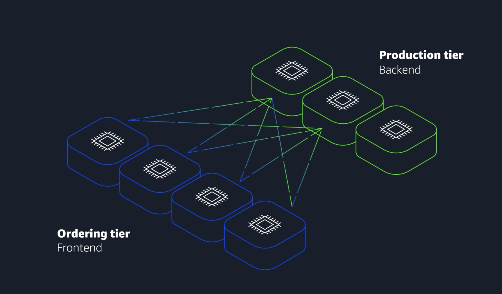
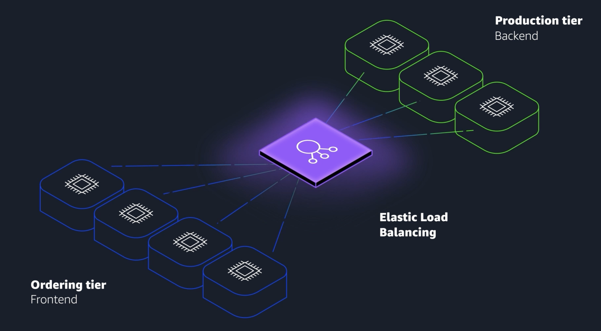

EC2 instances are virtual machines, or VMs. VMs share an underlying physical host machine with multiple other instances, which is a concept called multi-tenancy. In a multi-tenant environment, you need to make sure that each VM is isolated from each other but is still able to share resources provided by the host.

This job of resource sharing and isolation is being done by a piece of software called a hypervisor, which is running on the host machine. For EC2, AWS manages the underlying host, the hypervisor, and the isolation from instance to instance. So, even though you won't be managing this piece, it's important to have a basic grasp of the concept of multi-tenancy.

When you provision an EC2 instance, you can choose the operating system, or OS, based on either Windows or Linux. You can provision thousands of EC2 instances on demand, with a blend of operating systems and configurations to power your business' different applications.

EC2 TYpes

There are different types of instances that serve different purposes in your AWS environment. 
The different instance families are general purpose, compute optimized, memory optimized, accelerated computing, and storage optimized.

- General purpose instances provide a good balance of compute, memory, and networking resources. They can be used for lots of diverse workloads, like web services or code repositories. They’re also a good starting point if you don’t know how your workload will perform ahead of time.
- Compute-optimized instances are ideal for compute-intensive tasks, like gaming servers, high-performance computing, machine learning tasks--even scientific modeling.
- Memory-optimized instances are good for memory-intensive tasks. They deliver fast performance for workloads that process large data sets in memory.
- Accelerated-computing instances are good for floating point number calculations, graphics processing, or data pattern matching. This is because they use hardware accelerators. These are co-processors that perform functions more efficiently than is possible in software running on CPUs.
- storage-optimized instances are ideal for workloads that require high performance for locally stored data. 

## Elastic load balancing

Analogy : In coffee shop there are 3 cashiers but all customers are going to 1st counter only for orders.

To solve this issue we hired host who looks which cashier is avaible and direct customer to that counter.

similar to this we have Load balancing which directs the traffic to avaible EC2 instances

Benifet
Efficient traffic distribution:
ELB evenly distributes traffic across EC2 instances, preventing overload on any single instance and optimizing resource utilization.

Automatic scaling:
ELB scales with traffic and automatically adjusts to changes in demand for a seamless operation as backend instances are added or removed.

Simplified management:
ELB decouples front-end and backend tiers and reduces manual synchronization. It also handles maintenance, updates, and failover to ease operational overhead.

#### Routing methods

To optimize traffic distribution, ELB uses several routing methods: 
- Round Robin : Distributes traffic evenly across all available servers in a cyclic manner.), 
- Least Connections: Routes traffic to the server with the fewest active connections, maintaining a balanced load.), 
- IP Hash : Uses the client’s IP address to consistently route traffic to the same server.
- Least Response Time : Directs traffic to the server with the fastest response time, minimizing latency.

## Message queue

**Analogy :**
the cashier takes the order, writes it down with a pen and paper, and delivers this order to the barista. The barista then takes the paper and makes the order. When the next order comes in, the process repeats. This works great, as long as both the cashier and the barista are in sync. 

But what happens if the cashier took the order, turned to pass it to the barista, and the barista was on break or busy with another order? Well, that cashier is stuck until the barista is ready to take the order. And, at a certain point, the order will probably be dropped so the cashier can go serve the next customer. 

A much better process would be to introduce some sort of buffer or queue into the system. Instead of handing the order directly to the barista, the cashier would post the order to an order board. 

 This idea of placing messages into a buffer is called **messaging and queuing**

 If applications communicate directly, like our cashier and barista previously, that is called being tightly coupled. A hallmark trait of a tightly coupled architecture is this: If a single component fails or changes, it causes issues for the other components or even the whole system.   

 **Amazon SQS(Amazon Simple Queue Service)** (order board) makes it possible for you to send, store, and receive messages between software components at any volume. This is done without losing messages or requiring other message consumers to be available. 

 **SNS(Amazon Simple Notification Service)** is similar as it also sends messages to services, but it has a big distinction: Sent SNS messages aren't held for pickup until the processing service has a moment to get to them. Instead, SNS messages need a response right now. If SQS is the coffee orders board, SNS is the barista yelling out, "your order is ready!"

> Amazon EventBridge, Amazon SNS, and Amazon SQS are AWS services that help different parts of an application communicate effectively in the cloud. These services support building event-driven and message-based systems. 

