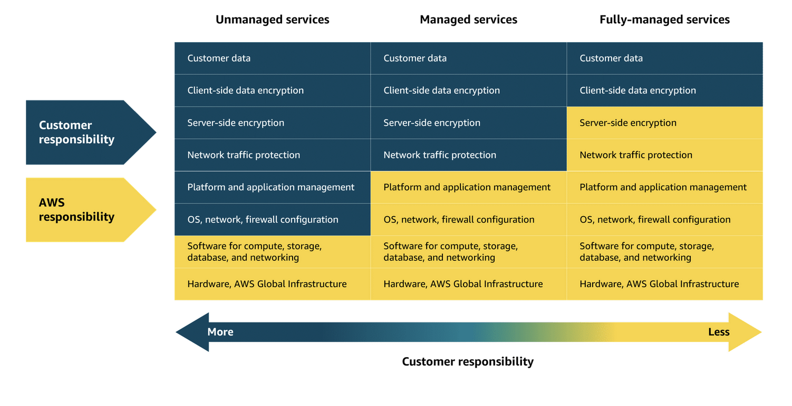

# Compute Service

EC2 are virtual machines which you can provision on aws.It provide high degree of control(aws unmanaged). means you need to dp patching, scaling, network configurations,and managing the operating system, while AWS manages the underlying infrastructure

AWS Unmanaged - More control over the things (example in coffe shop you have full control of how much beans you want to take and water and milk)

AWS managed - some things are pre-managed by aws so that we don't have to worrry. (like coffee shop machine having button with decided how much things will get out of it) ex. ELB,SQS,SNS

FullyManged : eliminating the need to provision or manage any servers at all. The underlying infrastructure is fully managed by AWS, so you can focus entirely on writing and deploying code.
ex. Lambda is a serverless compute service where AWS handles the infrastructure, scaling, and availability, while you remain responsible for securing and managing your application code.

# Lambda

Lambda is a serverless compute service. It’s also known as a Function as a Service. 
- It supports multiple langagues
- the maximum duration of a Lambda function is 15 minutes. If you codes is taking more than 15 min than lamba is best solution
- To run , put your code in in lambda, configure a trigger, and your function runs in response to that trigger. 
- Lambda is great for quick, event-driven processes. For example, handling website requests, processing batches of data, and generating expense reports.
- Lambda integrates with other AWS services quite easily. 
- **Defination** : Lambda is a serverless compute service that runs code in response to events without the need to provision or manage servers. It automatically manages the underlying infrastructure, scaling resources based on the volume of requests. You are charged only for the compute time consumed, down to the millisecond. Lambda handles execution, scaling, and resource allocation. You can optimize performance by configuring the appropriate memory size for your function