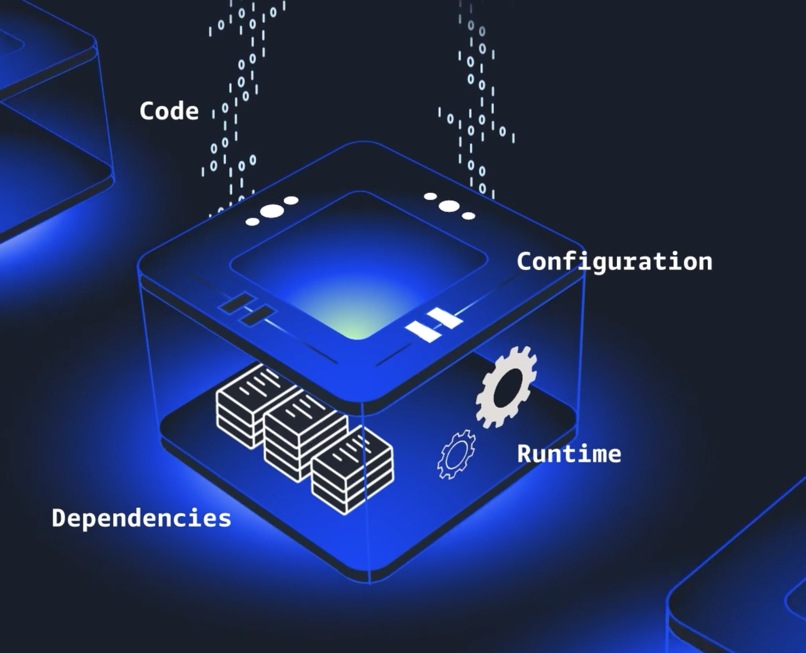

# Containers

Problem : Developer trying to deploy an application that’s worked perfectly on your computer but fails everywhere else. That’s frustrating.

Containers solve this portability problem by providing a consistent environment that can be replicated anywhere.

you can put containers on top of EC2 but again you have to manage scaling, starting , stopping, running them.
Here comes orchestration services which manages all.

These **orchestration services** automatically scale containers out when traffic increases—and scale back in when things calm down.  They also handle recovery from failure, monitoring, and updates, saving you tons of time and effort. 

Amazon gives 2 options for orchestration servers
1.  ECS (Elastic Container Service)
    - you want something streamlined and integrated
    - ECS automatically manages the containers and their infrastructure based on the parameters you set.
2.  EKS (Elastic kubernetes Service)
    - Kubernetes is an open source platform that automates containerized application deployment, scaling, and management. 
    - EKS makes it convenient to run Kubernetes clusters on AWS. 
    - It offers a lot of control and flexibility, especially for large-scale or hybrid deployments. 

## ECR
These orchestration services comes from Amazon ECR (Elastic Container Registry)

ECR is a fully managed container registry that stores your container images. You build your containers that have your application and all of its dependencies bundled together. From there, a container orchestration tool can pull the container image and deploy it. 
It supports container images that follow the Open Container Initiative (OCI) standards. 

Amazon offers two options to run containers
- EC2 : you manage the virtual machines that run your containers. With this option, you have full control, but you need to manage the underlying infrastructure.
- Fargate : Fargate is serverless and offers efficiency and convenience. With Fargate, AWS manages the servers, and you only need to worry about your containers. No need to manage a fleet for these containers to run on. 

## Full Flow
1. Upload container image to ECR
2. Choose orchestration service based on need : ECS or EKS
3. Select compute plateform to run your container : EC2 or Fargate

## Usecases

- Amazon ECS with Amazon EC2 is ideal for small-to-medium businesses that need full control over infrastructure. Suitable for custom applications requiring specific hardware or networking configurations, with the flexibility of Amazon EC2 and the simplicity of Amazon ECS.

- Amazon ECS with AWS Fargate is perfect for startups or small teams building web applications with variable traffic. It's a serverless option—no server management required—so teams can focus on development while Amazon ECS handles scaling and orchestration.

- Amazon EKS with Amazon EC2: This is best for enterprises needing full control over infrastructure. It offers deep customization of EC2 instances alongside Kubernetes scalability—ideal for complex, large-scale workloads.

- Amazon EKS with AWS Fargate: This is great for teams wanting Kubernetes flexibility without managing servers. It combines Kubernetes power with serverless simplicity, helping to scale applications quickly across various use cases.

# Others
## AWS BeanStalk
This is a service that makes it easier to deploy and manage applications in EC2.Instead of building out the needed infrastructure, like the network, EC2 instances, scaling, and elastic load balancers by yourself, you can provide your application code and desired configurations to the Elastic Beanstalk service. 
- Elastic Beanstalk then takes that information and builds out your environment for you. 
- Elastic Beanstalk also makes it easy to save environment configurations, so they can be deployed again. You won’t need to provision and manage all of these pieces separately, and 
- you’ll still have visibility and control of the underlying resources. 
- Good for: Deploying and managing web applications, RESTful APIs, mobile backend services, and microservices architectures, with automated scaling and simplified infrastructure management

### AWS Batch
Compute service designed for heavy-duty tasks like processing massive datasets, running simulations, or performing complex calculations.
- AWS Batch takes care of the infrastructure management for you. You won’t need to worry about provisioning servers, scaling resources, or managing infrastructure. 
- AWS Batch handles all of that, allowing you to focus on the important tasks like building your application or running your analysis. 
- The service also scales automatically, distributing tasks across a fleet of compute resources like EC2 instances. 
-  For heavy data duty task
- Good for: Processing large-scale, parallel workloads in areas like scientific computing, financial risk analysis, media transcoding, big data processing, machine learning training, and genomics research

### Amazon lighsail
simplifies web application hosting by giving you a relatively easy, cost-effective solution for running specific types of applications and websites. 
- It takes care of a lot of the complexity that comes with traditional web application hosting, and 
- it's a great option if you want something quick and easy to manage! 
- cost efficive
- Good for: Basic web applications, low-traffic websites, development and testing environments, small business websites, blogs, and learning cloud services

### Amazon outpost family
This one is designed for organizations that need a hybrid-cloud solution. If you want to leverage the power of AWS while keeping some of your infrastructure on premises, Outposts is the answer. 
- Outposts extends AWS services to your on-premises data center, giving you a consistent experience across both environments. 
- You get to run AWS services locally, while still benefiting from cloud computing.
- Hybrid cloud solution
- Consistent environnment
- low latenc and data residency or integration for hybrid deployments
- Good for: Low-latency applications, data processing in remote locations, migrating and modernizing legacy applications, and meeting regulatory compliance or data residency requirements

