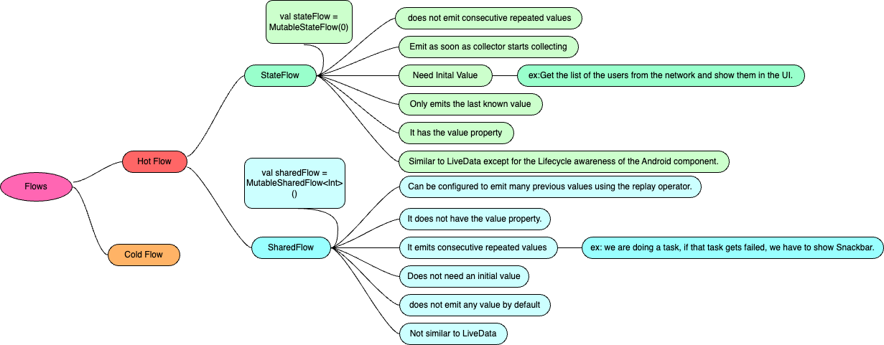
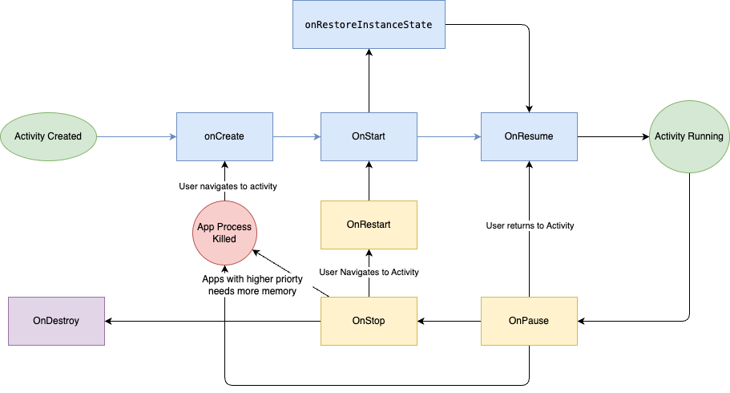

# Android


# Classes
- Data
- Object
- Sealed
- open

# jetPack
- Room
- DataStore
- WorkManager
- Paging


# UI
- Compose

# Coroutines
- Suspend
- Blocking
- RunBlocking
- Structured Concurrency
- Scope
- Context
- Launch
- async
- delay
- Internal workings of coroutines (state machine and continuation).
- How coroutines handle structure concurrency?
- Differences between coroutines and threads.
- Scopes and builders for coroutines.

# Kotlin 
- <a href="#FLOW">FLOW</a> 

# Basic Android Components 
- Activity Fragment Lifecycle
- <a href="#SSL-Pinning">SSL Pinning</a> 
- SQLITE
- Whats new in Android?
- MVP vs MVI vs MVVM: Differences and use cases.
- ViewModel survival during configuration changes: Understand ViewModel internals.
- RecyclerView view caching: How RecyclerView handles view caching internally.
- Android Handler, Looper, and message queue: Their roles in Android threading.
- Normal class vs data class: Differences in Kotlin.
- Activity and Fragment Lifecycle: Understand their lifecycle methods.
- Activity launch modes: Different launch modes in Android.
- Memory Management and solving memory leaks: Techniques to manage memory efficiently.
- StateFlow vs SharedFlow vs LiveData: Differences and when to use each.
- App performance improvement: Strategies to enhance app performance.
- Foreground service vs background service: Their distinctions and use cases.
- WorkManager vs AlarmManager: Choosing the right one for scheduling tasks.
- Benefits of Dependency Injection (Dagger and Hilt): Importance and alternatives to using DI frameworks.
- Ensuring app security: Best practices for securing Android applications.
- Encrypting and decrypting user data: Using RSA vs AES encryption algorithms.
- Networking and Data Persistence : Offline support. (Retrofit & Room)
Activity Lifecycle
- What is the difference between onCreate() and onStart()
- When only onDestroy is called for an activity without onPause() and onStop()?
    - when you put finish in oncreate :D
https://developer.android.com/guide/components/activities/activity-lifecycle


#### Tell all the Android application components

App components are the essential building blocks of an Android app. Each component serves a specific purpose and has its own lifecycle.

There are four types of app components:

• Activities: An activity is the entry point for user interaction. It represents a single screen with a user interface. For example, a login screen or a settings page is an Activity. Activities are managed in a stack, and you can navigate between them.
• Services: A Service is a component that runs in the background to perform long-running operations or handle tasks without a UI. For example, playing music or downloading a file can be managed by a Service. It doesn’t interact directly with the user but can communicate with other components.
• Broadcast receivers: A Broadcast Receiver listens for system-wide broadcast announcements or events, such as a low battery warning, a new SMS, or a custom event from another app.
• Content providers: It manages data sharing between different applications. Example: Sharing contacts or accessing media files from the gallery.

##  Chote magar mote baate

#### Kotlin

- val vs const val: Differences and usage scenarios.
- lateinit vs lazy: When to use each and how they work.
- Lambda and higher-order functions: Benefits and examples.
- object vs companion object: Usage and differences.
- Scope functions (let, apply, with, run): How they simplify code blocks.
- Extension functions: Implementing and utilizing extension functions effectively.
- == vs ===: Equality checks in Kotlin.
- Sealed class vs enum: Differences and use cases.
- Inline functions: Reasons for using inline, crossinline, and noinline functions.
- Synchronization in Kotlin: Understanding how it works.

- Difference between AAR, JAR, DEX, APK in Android ? 

    | Format    |   Contains	|   Used for	|   Can Include Resources?	|   Android-Specific?   |
    |---|----|---|---|---|
    |JAR|	.class files	|Java/Kotlin libraries                                  |	❌ No	|❌ No|
    |AAR	| .class, res/, AndroidManifest.xml	| Android libraries (SDKs, UI components)     |	✅ Yes|	✅ Yes|
    |DEX|	Compiled bytecode	|       Running apps on Android	                                        |❌ No	|✅ Yes|
    |APK|	.dex, res/, AndroidManifest.xml	|Final Android application                       |	✅ Yes|	✅ Yes|

        - Use JAR for pure Java/Kotlin libraries (e.g., Gson, OkHttp).
        - Use AAR for Android-specific libraries (e.g., custom UI components, third-party SDKs).
        - Use DEX indirectly (it’s generated automatically during compilation).
        - Use APK as the final installable package for Android apps.

- Different ways to add dependency in android
    - __implementation__ : The dependency is available at `compile-time` and `runtime`, but `not exposed` to other modules.
    - __api__ : Works like implementation, but it `exposes` the dependency to other modules.Other modules that depend on your library can also access the transitive dependency. Use When you are creating a library module and want to expose dependencies to other modules.
    - __compileOnly__ : The dependency is available at `compile-time` but not included in the APK. Used for annotations, provided dependencies, or optional APIs. Use When a library is needed only at compile-time but should not be packaged with the app.
    - __runtimeOnly__ : The dependency is `not available at compile-time`, but included in the APK. Use When a library is needed only at runtime (e.g., logging, database drivers).


## Mobile system desing (https://github.com/weeeBox/mobile-system-design/)

## SSL Pinning
#### What is SSL ?
SSL (Secure Sockets Layer) is a protocol for establishing authenticated and encrypted links between networked computers and servers.

#### How SSL Pinning will help to get rid of Middle Man attack ? 

SSL encrypts the data exchanged between our server and app, and the attacker middle man can’t view the actual data transmitted. Actual data exchanged will only be visible to our Server and App.

#### What is SSL pinning?
It is a process where we can check the authenticity of a HOST by checking its core X509 certificate. This X509 certificate is the integral part of SSL. we can find more about it here X509 certificate.
SSL pinning is a process which forces our client App to validate the server’s certificate against a known copy.


    we have a known KEY of our server’s certificate stored in our app (like we can store in strings or constants in some file) and then when we try to establish a connection with our server (means hit any API call), first we try to check if the connection is secure by matching the KEY we have in our app with Server’s certificate’s KEY.

    “If these both keys matches we are good to go our App connection is with our known(our own) Server”


we have these `3` certificates for every endpoint URL, and we can use any of these certificates’ KEY to check with our server’s certificate while making a connection.

> Root Certificate -> Intermediate Certificate -> leaf Certificate

When we pin one of these certficate there is pros and cons

#### Root Certificate : 
this is also known as Certificate Authority(CA), if we pin against this Root Certificate, that means we need to use the Certificate key of the Hosting service provider.

The benefit of using the Pinning to Root Certificate is it has a good long life (approx 10+ years) it will not expire soon hence we no need to worry to upload a new APK again and again just because our certificate expired and we got a new one with a new respective KEY.


#### Intermediate Certificate: 
If we use an Intermediate Certificate so we are relying on the company where our backend server is hosted. for eg. baltimore cybertrust, AWS, GoDaddy, etc.


#### Leaf Certificate : 
Leaf Certificate has a short expiry time (like approx 1 year) so If we pin this and use the KEY provided from this certificate in our App, then once it expires our backend Server gets a new Leaf Certificate hence new KEY, that time our app is blocked we need to update another APK of our app by adding this new KEY generated by newly issued Leaf Certificate.

#### Implementation

There are many ways to implement : 
- Retrofit with OkHttp using CertificatePinner.
- network_security_config.xml.

Using Retrofit
```kotlin
@Provides
@Singleton
fun provideRetrofit(){
    val API_BASE = "www.abc.com"
    val certificatePinner = CertificatePinner.Builder()
                .add(API_BASE,"Root Certficate Key")
                .build()

    val httpClient = OkhttpClient.newBuilder()
    httpClient.apply{
        certificatePinner(certificatePinner)
    }

    val converter = MoshiConvertorFactory.create(Moshi.Builder().add(KotlinJsonAdapterFactory.Build()).asLenient()

    return Retrofit.Builder()
                .baseUrl(API_BASE)
                .addConvertFactory(converter)
                .client(httpclient.build())
                .build()
} 
```

2nd way -  https://developer.android.com/privacy-and-security/security-config

create xml folder inside res directory. Create file `network_security_config.xml`

```xml
<?xml version="1.0" encoding="utf-8"?>
<network-security-config>
    <domain-config cleartextTrafficPermitted = "false" >
        <domain includeSubdomains="true">example.com</domain>
        <pin-set expiration="2025-01-26">
            <pin digest = "SHA-256">Root Certificate Key</pin>
        </pin-set>
    </domain-config>
</network-security-config>
```
add this file to `AndroidManifest.xml`
```xml
<?xml version="1.0" encoding="utf-8"?>
<manifest ... >
    <application android:networkSecurityConfig="@xml/network_security_config"
                    ... >
        ...
    </application>
</manifest>
```

## FLOW

Flow is an asynchronous data stream(which generally comes from a task) that emits values to the collector and gets completed with or without an exception.





## StateFlow vs SharedFlow:

```kotlin
StateFlow = SharedFlow
            .withInitialValue(initialValue)
            .replay(count=1)
            .distinctUntilChanged()

```

```kotlin
val sharedFlow = MutableSharedFlow<Int>(
    replay = 1,
    onBufferOverflow = BufferOverflow.DROP_OLDEST
)
sharedFlow.emit(0) // initial value
val stateFlow = sharedFlow.distinctUntilChanged()
```


## Where we have to use which Flow

`example1` : we have a use case: Get the list of the users from the network and show them in the UI.

```kotlin
//ViewModel
val usersStateFlow = MutableStateFlow<UiState<List<User>>>(UiState.Loading)

//Activity
usersStateFlow.collect {
print(it)
}

//ViewModel
usersStateFlow.value = UiState.Success(usersFromNetwork)


```
Now, if orientation changes, the ViewModel gets retained, and our collector present in the Activity will re-subscribe to collect. The following will be collected:

usersStateFlow: List of users which was set from the network. (StateFlow keeps the last value).

Advantage: No need for a new network call.

if we have used used SharedFlow here
- as soon as activity is subscribed to collect, it will not get any value and we to explicity add loading
- Now, if orientation changes, the ViewModel gets retained, and our collector present in the Activity will resubscribe to collect. Nothing will get collected here as SharedFlow is used which does not store any data. We will have to make a new network call.

Disadvantage: Un-necessary network call as we were already having the data.


`example 2` : suppose we are doing a task, if that task gets failed, we have to show Snackbar.

```kotlin 
//Viewmodel
val showSnackbarSharedFlow = MutableSharedFlow<Boolean>()
//Activity
showSnackbarSharedFlow.collect {

}


```

- as soon as activty subscribe, activity will not get anything
- if task get failed then only value got into collector
- in orientation change also it will not send any values to collector as activity will re-subscribe


### Unit testing : 

https://medium.com/1mgofficial/unit-testing-in-mvvm-kotlin-databinding-ba3d4ea08f0e

[sample](https://github.com/niharika2810/UnitTesting-MVVM-Kotlin-Koin-Coroutines-Sample)


# [Coroutines](https://outcomeschool.com/blog/kotlin-coroutines)

- What distinct coroutines from threads?
    - Executed within thread
    - coroutines are suspendable that means you can pause and resume in between tasks
    - They can switch context that means they can move from main thread to back thread easily

GlobalScope - this will live till our application will live
```kotlin
GlobalScope.launch{
    Log.d("",""+ Thread.currentThread.name) // Default Dispactcher -worker
}
```

delay is same sleep 

Delay will only work on that thread not whole thread this is misconception

```kotlin
GlobalScope.launch{
    delay(5000)
    Log.d("",""+ Thread.currentThread.name) // Default Dispactcher -worker
}
```
if you kill application within 5 sec then main thread is killed so coroutine will kill its worker thread also

### Start coroutines
there are two functions in kotlin to start the coroutines 
- launch{} : fire and forget
- async{} : perform a task and return a result

The difference is that the launch{} returns a Job and does not carry any resulting value whereas the async{} returns an instance of Deferred<T>, which has an await() function that returns the result of the coroutine like we have future in Java in which we do future.get() to get the result.

```kotlin
val deferred = GlobalScope.async(Dispatchers.Default) {
    // do something and return result, for example 20 as a result
    return@async 20
}
val result = deferred.await() // result = 20
```

### suspend Function 
Suspend function is a function that could be started, paused, and resume.Suspend functions are only allowed to be called from a coroutine or another suspend function


Coroutine Context : 
- Default : used for long running caclulation that will block main thread ex. sorting
- unconfind : this will remain in thread where suspend function is used
- IO : used for network calls , database operations, read and write files

```kotlin
GlobalScope.launch(Dispactcher.IO){
   result = network.call()
   withContext(Dispactcher.main){ // here we are switching backthread to main thread
    textFiled.text = result
   }
}

```

withContext is a suspend function through which we can do a task by providing the Dispatchers on which we want the task to be done.

withContext does not create a new coroutine, it only shifts the context of the existing coroutine and it's a suspend function whereas launch and async create a new coroutine and they are not suspend functions.

As withContext is a suspend function, it can be only called from a suspend function or a coroutine. So, both the above functions are suspend functions.


### RunBlocking 
- it will block main thread and it is coroutine scope
- used to run suspend functino on main thread .
- it is synchronous
- used in testcases also
- Used to check how coroutines works

```kotlin
runblocking{delay(3000)}
```
example : 

```kotlin
Log.d("Before run blocking " )
runBlocking{
    launch(Dispacher.IO){
        delay(5000)
        Log.d("launch")
    }

    Log.d("Start run blocking ")
    Delay(5000)
    Log.d("End run blocking ")
}
Log.d("After run blocking " )
// Output 
//Before run blocking
//Start run blocking
//launch 1
//launch 2
//End run blocking
//After run blocking 


```

- Global scope is living till app dies what is time to live for runblocking as its working on main thread?


### Scopes
Scopes in Kotlin Coroutines are very useful because we need to cancel the background task as soon as the activity is destroyed

- lifecycleScope : to cancle background task as soon as activity is destroyed
- ViewModelScope : to cancel background task as soon as viewmodel is destroyed

### Exception handling
 we generally handle exceptions using try catch but in coroutines there is another way also

 ```kotlin
 // 1st method
 GlobalScope.launch(Dispatcher.Main){
    try{
        fetchFromDb()
    }catch(e: Exception){
        Log.d(TAG,e.message())
    }
 }

 // 2nd Method

val handler = CoroutineExceptionHandler { _, exception ->
    Log.d(TAG, "$exception handled !")
}
GlobalScope.launch(Dispatchers.Main + handler) {
    fetchFromDb() // do on IO thread and back to UI Thread
}

```

For async we have to use try catch only

IN below code i want to call two apis in parrlel if anyone fails it should return empty list. how can we do?

```kotlin
//Question
launch {
    val users = try {
        getUsers()
    } catch (e: Exception) {
        emptyList<User>()
    }
    val moreUsers = try {
        getMoreUsers()
    } catch (e: Exception) {
        emptyList<User>()
    }
}
```

```kotlin
// solution
launch {
    supervisorScope {
        val usersDeferred = async { getUsers() }
        val moreUsersDeferred = async { getMoreUsers() }
        val users = try {
            usersDeferred.await()
        } catch (e: Exception) {
            emptyList<User>()
        }
        val moreUsers = try {
            moreUsersDeferred.await()
        } catch (e: Exception) {
            emptyList<User>()
        }
    }
}

```
The major difference is that a coroutineScope will cancel whenever any of its children fail. If we want to continue with the other tasks even when one fails, we go with the supervisorScope. A supervisorScope won't cancel other children when one of them fails.


### suspending vs blocking 
the key difference lies in how coroutines handle waiting for asynchronous operations. 

Suspending allows a coroutine to yield control without blocking the underlying thread, enabling better concurrency and resource utilization. 

Blocking, on the other hand, involves the thread waiting until the operation completes, which can lead to inefficiencies in terms of resource usage. 

Coroutines are designed to be more efficient by leveraging suspending functions to avoid unnecessary blocking and allow other tasks to proceed in the meantime.

The main difference is that the runBlocking method blocks the current thread for waiting, while coroutineScope just suspends, releasing the underlying thread for other usages. Because of that difference, runBlocking is a regular function and coroutineScope is a suspending function.

example : 

```kotlin 
private val dispatcher = Executers.newSingleThreadExceutor().asCoroutineDispatcher()

// SUSPENDING

fun exSUSPENDING(){
     lifecycleScope.launch(dispacher){
            Log.d("before 1")
            timeTakingTask()
            Log.d("after 1")
    }
    lifecycleScope.launch(dispatcher){
            Log.d("before 2")
            timeTakingTask()
            Log.d("after 2")
    }
}
/**
before 1
before 2
after 1
after 2
**/

// blocking
fun exBlocking(){
    lifecycleScope.launch(dispacher){
        runBlocking{
            Log.d("before 1")
            timeTakingTask()
            Log.d("after 1")
        }
    }
    lifecycleScope.launch(dispatcher){
        runBlocking{
            Log.d("before 2")
            timeTakingTask()
            Log.d("after 2")
        }
    }
}

/**
Output : 
before 1
after 1
before 2
after 2
**/

fun timeTakingTask(){
    withContext(Dispatcher.IO){
        Thread.sleep(5000)
    }
}
```

### Jobs , Cancelation, timeouts


## Activity

Lifecycle of Activity: 



In the onCreate() method, perform basic application startup logic that happens only once for the entire life of the activity.
For example, your implementation of onCreate() might bind data to lists, associate the activity with a ViewModel, and instantiate some class-scope variables. This method receives the parameter savedInstanceState, which is a Bundle object containing the activity's previously saved state. If the activity has never existed before, the value of the Bundle object is null. 

```kotlin
// This callback is called only when there is a saved instance previously saved using
// onSaveInstanceState(). Some state is restored in onCreate(). Other state can optionally
// be restored here, possibly usable after onStart() has completed.
// The savedInstanceState Bundle is same as the one used in onCreate().
override fun onRestoreInstanceState(savedInstanceState: Bundle?) {
    textView.text = savedInstanceState?.getString(TEXT_VIEW_KEY)
}

// Invoked when the activity might be temporarily destroyed; save the instance state here.
override fun onSaveInstanceState(outState: Bundle?) {
    outState?.run {
        putString(GAME_STATE_KEY, gameState)
        putString(TEXT_VIEW_KEY, textView.text.toString())
    }
    // Call superclass to save any view hierarchy.
    super.onSaveInstanceState(outState)
}
```

Onstart call makes the activity visible to the user as the app prepares for the activity to enter the foreground and become interactive. For example, this method is where the code that maintains the UI is initialized. 


In OnResume state : When the activity enters the Resumed state, it comes to the foreground, and the system invokes the onResume() callback. This is the state in which the app interacts with the user. The app stays in this state until something happens to take focus away from the app, such as the device receiving a phone call, the user navigating to another activity, or the device screen turning off. 

>Note : In multi-window mode, however, your activity might be fully visible even when it is in the Paused state. For example, when the app is in multi-window mode and the user taps the window that does not contain your activity, your activity moves to the Paused state.

onPause()
The system calls this method as the first indication that the user is leaving your activity, though it does not always mean the activity is being destroyed. It indicates that the activity is no longer in the foreground, but it is still visible if the user is in multi-window mode.

ex 
In multi-window mode, only one app has focus at any time, and the system pauses all the other apps.
The opening of a new, semi-transparent activity, such as a dialog, pauses the activity it covers. As long as the activity is partially visible but not in focus, it remains paused. 

You can also use the onPause() method to release system resources, handles to sensors (like GPS), or any resources that affect battery life while your activity is Paused and the user does not need them.

onPause() execution is very brief and does not necessarily offer enough time to perform save operations. For this reason, don't use onPause() to save application or user data, make network calls, or execute database transactions. Such work might not complete before the method completes.

onStop()
When your activity is no longer visible to the user, it enters the Stopped state
This can occur when a newly launched activity covers the entire screen. 

 In the onStop() method, release or adjust resources that are not needed while the app is not visible to the user. For example, your app might pause animations or switch from fine-grained to coarse-grained location updates. Using onStop() instead of onPause() means that UI-related work continues, even when the user is viewing your activity in multi-window mode.

Also, use onStop() to perform relatively CPU-intensive shutdown operations. For example, if you can't find a better time to save information to a database, you might do so during onStop(). 

>Note: Once your activity is stopped, the system might destroy the process that contains the activity if the system needs to recover memory. Even if the system destroys the process while the activity is stopped, the system still retains the state of the View objects, such as text in an EditText widget, in a Bundle—a blob of key-value pairs—and restores them if the user navigates back to the activity.

onDestroy() is called before the activity is destroyed. The system invokes this callback for one of two reasons:

- The activity is finishing, due to the user completely dismissing the activity or due to finish() being called on the activity.
- The system is temporarily destroying the activity due to a configuration change, such as device rotation or entering multi-window mode.
 
Instead of putting logic in your Activity to determine why it is being destroyed, use a ViewModel object to contain the relevant view data for your Activity. If the Activity is recreated due to a configuration change, the ViewModel does not have to do anything, since it is preserved and given to the next Activity instance.

If the Activity isn't recreated, then the ViewModel has the onCleared() method called, where it can clean up any data it needs to before being destroyed. You can distinguish between these two scenarios with the isFinishing() method.

If the activity is finishing, onDestroy() is the final lifecycle callback the activity receives. If onDestroy() is called as the result of a configuration change, the system immediately creates a new activity instance and then calls onCreate() on that new instance in the new configuration. 

The system never kills an activity directly to free up memory. Instead, it kills the process the activity runs in, destroying not only the activity but everything else running in the process as well.

>Note: onSaveInstanceState() is not called when the user explicitly closes the activity or in other cases when finish() is called.

if the system destroys the activity due to system constraints (such as a configuration change or memory pressure), then although the actual Activity instance is gone, the system remembers that it existed. If the user attempts to navigate back to the activity, the system creates a new instance of that activity using a set of saved data that describes the state of the activity when it was destroyed.

The saved data that the system uses to restore the previous state is called the instance state. It's a collection of key-value pairs stored in a Bundle object. By default, the system uses the Bundle instance state to save information about each View object in your activity layout, such as the text value entered into an EditText widget.

A Bundle object isn't appropriate for preserving more than a trivial amount of data, because it requires serialization on the main thread and consumes system-process memory. To preserve more than a very small amount of data, take a combined approach to preserving data, using persistent local storage, the onSaveInstanceState() method, and the ViewModel class, as outlined in Save UI states

Instead of restoring the state during onCreate(), you can choose to implement onRestoreInstanceState(), which the system calls after the onStart() method. The system calls onRestoreInstanceState() only if there is a saved state to restore, so you do not need to check whether the Bundle is null.

the order of operations that occur when Activity A starts Activity B:

    - Activity A's onPause() method executes.
    - Activity B's onCreate(), onStart(), and onResume() methods execute in sequence. Activity B now has user focus.
    - If Activity A is no longer visible on screen, its onStop() method executes.

- When only onDestroy is called for an activity without onPause() and onStop()?

    - when you call `finish()` in `OnCreate()` function. 
- Why do we need to call setContentView() in onCreate() of Activity class? 
    - because `OnCreate()` is called once.if we call it in another methods then UI will set again and again which is not efficient way.
- What is onSaveInstanceState() and onRestoreInstanceState() in activity?
    - already described above or check this [link](https://developer.android.com/guide/components/activities/activity-lifecycle)

## Fragment

fragments live inside activities, and each activity can host many fragments. Like activities, they have a specific lifecycle, unlike activities, they are not top-level application components. Advantages of fragments include code reuse and modularity (e.g., using the same list view in many activities), including the ability to build multi-pane interfaces (mostly useful on tablets). The main disadvantage is (some) added complexity. You can generally achieve the same thing with (custom) views in a non-standard and less robust way. 

A Fragment represents a reusable portion of your app's UI. A fragment defines and manages its own layout, has its own lifecycle, and can handle its own input events. Fragments can't live on their own. They must be hosted by an activity or another fragment. 

Dividing your UI into fragments makes it easier to modify your activity's appearance at runtime.

fragments can be added, replaced, or removed. And you can keep a record of these changes in a back stack that is managed by the activity, so that the changes can be reversed.

The Fragment library also provides more specialized fragment base classes:
    - DialogFragment
    - PreferenceFragmentCompat

FragmentActivity is the base class for AppCompatActivity

There are two ways to add Fragment 
- the fragment in your activity's layout file
- fragment container in your activity's layout file and then programmatically adding the fragment from within your activity.

In either case, you need to add a FragmentContainerView that defines the location where the fragment should be placed within the activity's view hierarchy. It is strongly recommended to always use a FragmentContainerView as the container for fragments, as FragmentContainerView includes fixes specific to fragments that other view groups such as FrameLayout do not provide.

[`FragmentManager`](https://developer.android.com/guide/fragments/fragmentmanager) is the class responsible for performing actions on your app's fragments, such as adding, removing, or replacing them and adding them to the back stack.
You might never interact with FragmentManager directly if you're using the Jetpack Navigation library, as it works with the FragmentManager on your behalf.
Fragments can host one or more child fragments. Inside a fragment, you can get a reference to the FragmentManager that manages the fragment's children through getChildFragmentManager(). If you need to access its host FragmentManager, you can use getParentFragmentManager(). [more Detail](https://developer.android.com/guide/fragments/fragmentmanager#access)

[Child fragments] (https://developer.android.com/guide/fragments/fragmentmanager#child)
usecase : Jetpack Navigation uses child fragments as individual destinations. An activity hosts a single parent NavHostFragment and fills its space with different child destination fragments as users navigate through your app.

As an alternative to using a LifecycleObserver, the Fragment class includes callback methods that correspond to each of the changes in a fragment's lifecycle. These include onCreate(), onStart(), onResume(), onPause(), onStop(), and onDestroy().

A fragment's view has a separate Lifecycle that is managed independently from that of the fragment's Lifecycle. Fragments maintain a LifecycleOwner for their view, which can be accessed using getViewLifecycleOwner() or getViewLifecycleOwnerLiveData().

When a fragment is instantiated, it begins in the INITIALIZED state. For a fragment to transition through the rest of its lifecycle, it must be added to a FragmentManager. The FragmentManager is responsible for determining what state its fragment should be in and then moving them into that state.

Beyond the fragment lifecycle, FragmentManager is also responsible for attaching fragments to their host activity and detaching them when the fragment is no longer in use. The Fragment class has two callback methods, onAttach() and onDetach(), that you can override to perform work when either of these events occur.

The onAttach() callback is invoked when the fragment has been added to a FragmentManager and is attached to its host activity. At this point, the fragment is active, and the FragmentManager is managing its lifecycle state. At this point, FragmentManager methods such as findFragmentById() return this fragment.

onAttach() is always called before any Lifecycle state changes.

The onDetach() callback is invoked when the fragment has been removed from a FragmentManager and is detached from its host activity. The fragment is no longer active and can no longer be retrieved using findFragmentById().

onDetach() is always called after any Lifecycle state changes.

Note that these callbacks are unrelated to the FragmentTransaction methods attach() and detach(). 

>Caution: Avoid using the <fragment> tag to add a fragment using XML, as the <fragment> tag allows a fragment to move beyond the state of its FragmentManager. Instead, always use FragmentContainerView for adding a fragment using XML.

Created : 

When your fragment reaches the CREATED state, it has been added to a FragmentManager and the onAttach() method has already been called.
This transition invokes the onCreate() callback. The callback also receives a savedInstanceState Bundle argument containing any state previously saved by onSaveInstanceState(). Note that savedInstanceState has a null value the first time the fragment is created, but it is always non-null for subsequent recreations, even if you do not override onSaveInstanceState()


- What is the difference between FragmentPagerAdapter vs FragmentStatePagerAdapter?
    - FragmentPagerAdapter: Each fragment visited by the user will be stored in the memory but the view will be destroyed. When the page is revisited, then the view will be created not the instance of the fragment.
    FragmentStatePagerAdapter: Here, the fragment instance will be destroyed when it is not visible to the user, except the saved state of the fragment.


- What is difference between add and replace fragment ? 
    - replace removes the existing fragment and adds a new fragment. This means when you press back button the fragment that got replaced will be created with its onCreateView being invoked. Whereas add retains the existing fragments and adds a new fragment that means existing fragment will be active and they wont be in 'paused' state hence when a back button is pressed onCreateView is not called for the existing fragment(the fragment which was there before new fragment was added).
    
    - In terms of fragment's life cycle events onPause, onResume, onCreateView and other life cycle events will be invoked in case of replace but they wont be invoked in case of add. 

- What is retained Fragment?
    - A retained fragment in Android refers to a fragment that persists across configuration changes, such as screen rotations, without being destroyed and recreated.The fragment instance is retained across activity recreation, ensuring that its non-UI data remains intact. However, the fragment's views are still destroyed and recreated during configuration changes
    
    - onDestroy() is not called, but onDetach() is still executed because the fragment detaches from its previous activity
    - onCreate(Bundle) is skipped since the fragment isn't re-created
    - Methods like onAttach(Activity) and onActivityCreated(Bundle) are still invoked

- What is the purpose of addToBackStack() while commiting fragment transaction?
    - [link](https://stackoverflow.com/questions/22984950/what-is-the-meaning-of-addtobackstack-with-null-parameter)

- How Android Image Loading library optimizes memory usage ?
    - To optimize memory usage and use less memory, Glide ,Fresco does downsampling.Downsampling means scaling the bitmap(image) to a smaller size which is actually required by the view.Assume that we have an image of size 4000*4000, but the view size is 200*200. So why load an image of 4000*4000, Glide down-samples the bitmap to 200*200, and then show it into the view.

## launch modes 
We use launchMode to give instructions to the Android operating system about how to launch the activity


#### Single Task

example : 
A > B > C > D > E
c is single task 
if you call C after E then stack will become like
A > B > C 
and C will get new Extras from `onNewIntent()`


### References 

- https://nik-arora8059.medium.com/android-learning-resources-77a67a77d340
- https://readmedium.com
- https://readmedium.com/en/https:/medium.com/mobile-app-development-publication/dagger-2-and-koin-comparison-4223dae9725d
- [Android development best practices](https://github.com/niharika2810/android-development-best-practices)
- https://www.youtube.com/@StudyingWithAlex

github pages for full List 
- https://github.com/niharika2810/android-learning-resources
- https://github.com/vamsitallapudi/Android-Interview-Questions-And-Answers
- [Design Patterns](https://github.com/vishalguptahmh/java-design-patterns)
- [Android Interview Questions](https://github.com/niharika2810/android-interview-questions)
- [Android Learning Resource](https://nik-arora8059.medium.com/android-learning-resources-77a67a77d340)
- https://github.com/anitaa1990/Android-Cheat-sheet