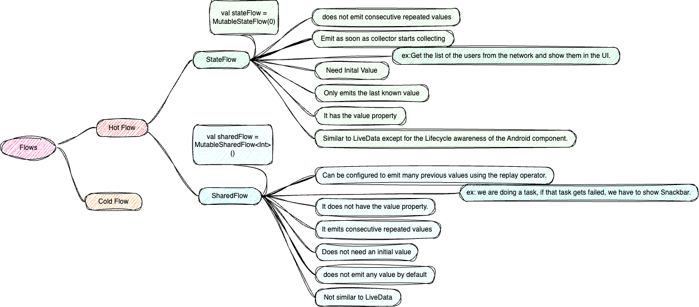

# Android


# Classes
- Data
- Object
- Sealed
- open

# jetPack
- Room
- DataStore
- WorkManager
- Paging


# UI
- Compose


# Coroutines
- Suspend
- Blocking
- RunBlocking
- Structured Concurrency
- Scope
- Context
- Launch
- async
- delay


# FLOW



Flow is an asynchronous data stream(which generally comes from a task) that emits values to the collector and gets completed with or without an exception.


## StateFlow vs SharedFlow:

```kotlin
StateFlow = SharedFlow
            .withInitialValue(initialValue)
            .replay(count=1)
            .distinctUntilChanged()

```

```kotlin
val sharedFlow = MutableSharedFlow<Int>(
    replay = 1,
    onBufferOverflow = BufferOverflow.DROP_OLDEST
)
sharedFlow.emit(0) // initial value
val stateFlow = sharedFlow.distinctUntilChanged()
```


## Now lets where see where we have to use which Flow

example1 : we have a use case: Get the list of the users from the network and show them in the UI.

```kotlin
//ViewModel
val usersStateFlow = MutableStateFlow<UiState<List<User>>>(UiState.Loading)

//Activity
usersStateFlow.collect {
print(it)
}

//ViewModel
usersStateFlow.value = UiState.Success(usersFromNetwork)


```
Now, if orientation changes, the ViewModel gets retained, and our collector present in the Activity will resubscribe to collect. The following will be collected:

usersStateFlow: List of users which was set from the network. (StateFlow keeps the last value).

Advantage: No need for a new network call.

if we have used used SharedFlow here
- as soon as activity is subscribed to collect, it will not get any value and we to explicity add loading
- Now, if orientation changes, the ViewModel gets retained, and our collector present in the Activity will resubscribe to collect. Nothing will get collected here as SharedFlow is used which does not store any data. We will have to make a new network call.

Disadvantage: Unnecessary network call as we were already having the data.


example 2 : suppose we are doing a task, if that task gets failed, we have to show Snackbar.

```kotlin 
//Viewmodel
val showSnackbarSharedFlow = MutableSharedFlow<Boolean>()
//Activity
showSnackbarSharedFlow.collect {

}


```

- as soon as activty subscribe, activity will not get anything
- if task get failed then only value got into collector
- in orientation change also it will not send any values to collector as activity will re-subscribe


Unit testing : 

https://medium.com/1mgofficial/unit-testing-in-mvvm-kotlin-databinding-ba3d4ea08f0e
[sample](https://github.com/niharika2810/UnitTesting-MVVM-Kotlin-Koin-Coroutines-Sample)

### References 

- https://nik-arora8059.medium.com/android-learning-resources-77a67a77d340
- https://readmedium.com
- https://readmedium.com/en/https:/medium.com/mobile-app-development-publication/dagger-2-and-koin-comparison-4223dae9725d
- [Android development best practices](https://github.com/niharika2810/android-development-best-practices)
- https://www.youtube.com/@StudyingWithAlex

github pages for full List 
- https://github.com/niharika2810/android-learning-resources
- https://github.com/vamsitallapudi/Android-Interview-Questions-And-Answers
- [Design Patterns](https://github.com/vishalguptahmh/java-design-patterns)
- [Android Interview Questions](https://github.com/niharika2810/android-interview-questions)
- [Android Learning Resource](https://nik-arora8059.medium.com/android-learning-resources-77a67a77d340)
- https://github.com/anitaa1990/Android-Cheat-sheet
