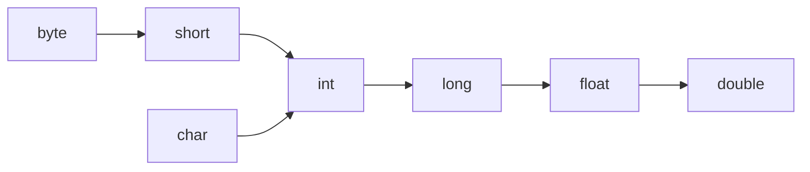

# OOPS

OOP (Object-Oriented Programming) is a programming paradigm based on the concept of objects, which are instances of classes. The core concepts of OOP are:

1. Encapsulation: Hiding the internal state of an object and controlling access through methods (getters/setters).
2. Abstraction: Hiding the complexity of implementation and exposing only necessary details.
3. Inheritance: Creating new classes from existing ones, inheriting properties and behaviors.
4. Polymorphism: Allowing objects of different classes to be treated as objects of a common superclass, enabling different behaviors (method overriding or overloading).
5. Classes and Objects: A class is a blueprint for creating objects, and an object is an instance of a class.

OOP promotes modularity, reusability, and maintainability, making it easier to structure complex programs.


## Abstraction
It is about hiding complex details or implementation and providing a simplified interface or representation. 

Example

1. layman know how to use ATM card. but don't know where validation is happening and how its happening.

2. You can press buttons to change the channel, adjust the volume, or power it on/off, but you don’t need to understand how the television’s circuit board or the signal processing works.


In OOP, abstraction allows you to hide the details of an object's implementation by creating abstract classes or interfaces.

<ins>Benefits of Abstraction:</ins>

- Simplifies Code: By focusing on high-level operations and hiding unnecessary details, your code is simpler and more understandable.
- Reduces Redundancy: You don’t have to keep repeating implementation details; they are abstracted away.
- Encapsulates Changes: Changes to the internal workings of a class or function don't affect how it is used externally.
- Improves Maintenance: If you need to change how an operation works, you only need to change the implementation without affecting the rest of the system.

or 

- Security
- Enhacement
- Maintainablity
- Modularity


## Encapusaltion 

The process of grouping data members and corresponding methods into a single unit. you can relate it to casules that we use for medicine. the main medicine is bundled in single pouch that we call capsule.
if any component follows data hiding and abstraction that component called encapuslated component.

`Datahiding + abstraction` 

Key Difference:

- Encapsulation is about protecting and controlling access to an object's data.
- Abstraction is about hiding the complexity of the internal workings of an object.

```java

class Acount {

    private double balance; // by making variable private we are hiding data

    public doube getbalance(){ // balance is not directly acceable but its accessable by getter or setting methods after validation
        // validation
        return balance;
    }
    public void addAmount(double amount){
        //validation
        this.balance = this.balance+amount;

    }
}
```

Is this example is encapsulation?

these getter and setting method will not directly accessable to user. User will have GUI which will have 2 buttons

1. balance enquiery 
2. deposit 

__HIDING DATA BEHIND MEHTODS IS CONCEPT OF ENCAPSULATION__

Advantages are same as of hiding data+ abstraction

<ins>Disadvantages of Encapuslation:</ins>
- Increases number of line of code
- slows down the execution (example : to transfer 10k to friend , we have to give username , password , otp)

## Tightly Encapsulated class

if all variables are private then its TEC.it doesn't matter whether getter setter method is there or not.


## Overloading and Overriding

> what is method signature?

In method `public void method(int i , float f)`  method signature is `method(int,float)`. means name+ parameter type
In java return type is not comes into signature but in c++ return type also comes into signature.

Compiler uses method signature for resolving method calls


### OverLoading

when both methods have same name but different argument type

In overloading , method resolution is taken care by compiler based on reference type not run time object that's its also called as compile time polymorphism or static polymorphism or early binding

example 
```java
public void m1(int)
public void m1(float)
```

overloading is not avaible in C langaugage. C lang is not object oriented. you have to create different method in C lang

Overloading provide more flexibility to programmer.in C there is function abs(int),fabs(float),labs(long) but in java you can define with same name

C
```c
void abs(int);
void fabs(float);
void labs(long);
```
Java
```java
public void abs(int);
public void abs(float);
public void abs(long);
```




