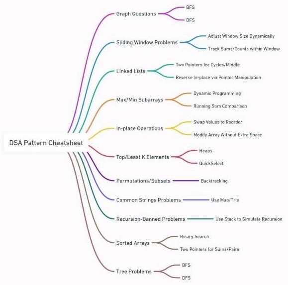

# How to Start

### Learn Basic of
#### your langauge
ex variables,DataTypes,Loops,if/Else,Array/Strings,Functions/Classes,Input/Output Operations

#### Space and Time Complixity , Big O notation

#### Datastructure : Arrays,Strings,LinkList,STacks,Queue,Hashtable,

#### ALGOs

ex.Sortings,Binary Search , Recursion 

Binary Tree [youtubeLink](https://youtu.be/Qmt0QwzEmh0?si=F9ampCBr4kUuOk27)
[Abdul Bari youtube](https://youtu.be/-qOVVRIZzao?si=U9lch-as-qyPCt-1) and 

DSA Patterns [Algo Master youtube link](https://youtu.be/QzZ7nmouLTI?si=3WiO_u_mdZ1Gat1p)

Solve Leet code problems , start with easy then move on to Medium
you can go with buckets created by leetcode for iterviews.

you can practice pattern list by going [algomaster](https://algomaster.io/practice/dsa-patterns) and select pattern and `i` there is link to learn also. its very usefull

Most common Pattern List
- Prefix Sum
- Two Pointer
- Sliding Window
- Fast and Slow Pointer
- LinkList in-place reversal
- Monotonic Stack
- Top K elements
- Overlapping intervals
- Modified Binary Tree
- Binary tree traversal
- DFS
- BFS
- Mattrix Traversal
- BackTracking



Company Wise Leet code problem list [github](https://github.com/krishnadey30/LeetCode-Questions-CompanyWise)


### Sortings(with time and space complexity)

|ALGO|Best|Wors|Space|
|--|--|--|--|
|Bubble Sort|  `O(n)`| `O(n^2)`||
| Insertion Sort | `O(n)`| `O(n^2)` ||
|Merge Sort |`O(nlogn)`| `O(nlogn)`| `O(n)`|
| Quick Sort | `O(nlogn)`|`O(n^2)`|`O(logn)`|
|Selection Sort |`O(n^2)`| `O(n^2)`||


# Array
Time Complexity : 
|Doing|Time|
|--|--|
|Inserting|O(n)|
|Deleting|O(n)|
|Read|O(1)|

# LinkList
Time Complexity : 
|Doing|Time|
|--|--|
|Inserting at first |O(1)|
|Inserting at Last |O(n)|
|Deleting at first|O(1)|
|Deleting at last |O(n)|
|Read at first|O(1)|
|Read at last |O(n)|
# HashMap
Time Complexity : 
|Doing|Time|
|--|--|
|Inserting|O(1)|
|Deleting|O(1)|
|Read|O(1)|

# Stacks (LIFO)
Time Complexity : 
|Doing|Time|
|--|--|
|Push|O(1)|
|Pop|O(1)|
|peek(read first element)|O(1)|

# Queue (FIFO)
Time Complexity : 
|Doing|Time|
|--|--|
|Enqueue(Adding)|O(1)|
|Dequeue(Deleting)|O(1)|
|Front(Read)|O(1)|


# Trees
Binary Search Tree: Time complexity = O(logn)

DFS: depth first search
Time complexity : O(Nodes+branches)
Usefull : to solve maze

BFS: breath first search
Time complexity : O(Nodes+branches)
Usefull : for chess algos
checking for possible moves and then checking again from those possible moves
# Graphs

Usefull:
to find nearest store to you

# Greedy ALGO
it check what is best at that point not overall so its not used for efficieny
ex : https://youtu.be/kp3fCihUXEg?list=PLUITAQK78D8PByrC3XDuF-elzSK7QWXO5&t=1009

so if problem is very complex and you don't want exact outcome then use greedy
ex [Travelling salesman problem](https://youtu.be/kp3fCihUXEg?list=PLUITAQK78D8PByrC3XDuF-elzSK7QWXO5&t=1119) 


## Details of Algos
### BST
Binary Tree having upto 2 child nodes
Binary search tree is type of Binary Tree having left `nodes` is less than parent node and right `nodes` is greater than parent node.
lets take example : 
8(P)- 2(L)-15(R)
2(P)- 1(L)-10(R)

so this is not a BST because 10 is greater than 8 but its greater than 2 and right side of 2

so values Goes from -∞ to +∞
if parent is 8 then for left side values should be between -∞ to 8 and right side nodes should be between 8 to +∞

check its BST OR NOT - https://www.geeksforgeeks.org/problems/check-for-bst/1
insert node - https://www.geeksforgeeks.org/problems/insert-a-node-in-a-bst/1
Kth Smallest/Largest Element in BST  https://www.geeksforgeeks.org/problems/find-k-th-smallest-element-in-bst/1


### Strings
- Check a String is palindrome or not
- Remove any given character from a String
- Find out longest palindrome in a given string
- Find the first non repeated character of a given String
- Count the occurrence of a given character in a String
- Check if two String are Anagram
- Convert numeric String to int in Java
- Reverse words in a given string
```
 input :Hi I am vishal
 output: vishal am I Hi
```
- Permutations of a given string
```
input : ABC
output : ABC ACB BAC BCA CAB CBA 
```
- Check if string is rotated by certain number then we get original string
```
input : 3
vishal
halvis
output: yes
```
- Remove Duplicate char from string
  
----
### LinkList
- `!` [ Insert Element at first](algorithms/singlelinklist.md)
- `!`[ Inserting node at nth position](algorithms/singlelinklist.md)
- `!`[ Delete Node at nth position](algorithms/singlelinklist.md)
- `!`[ Reverse a linked list with recursion ](algorithms/singlelinklist.md)
- `!`[ Reverse a linked list without recursion](algorithms/singlelinklist.md)
- `!`[ Implement stack using Linklist](algorithms/singlelinklist.md)
- [Find the 4th node from the end in a singly linked list](algorithms/singlelinklist.md)
- [Find the middle element of a singly linked list in one pass](algorithms/singlelinklist.md)
- [Check if a given linked list contains a cycle/loop?find the starting node of the cycle and remove the loop ](algorithms/singlelinklist.md)
- Find Merge point of Two singly linklist
- Remove duplicate nodes in an unsorted linked list
- Find the sum of two linked lists using Stack
- Rotate a Linked List
- Reverse a Linked List in groups of given size
  ```
  input : 2
  1234
  output: 2143
  ```
- Merge two sorted linked lists and final output is sorted
- Add two numbers represented by linked lists
  ```
  input:
  1->2
  3->4
  output: 4>6 (sum of 12 + 34 =46)
  ```
- Check if Linked List is Palindrome
- Implement Queue using Linked List
- Implement Stack using Linked List
- Given a linked list of 0s, 1s and 2s, sort it
- Delete without head pointer and printing function is given
  ```
  input : 5 
          1234567
  output: 123467
  ```
### Doubly LinkList
- ! Insert at first

  ---
### Tree
- Binary tree in preorder with and without recursion
- Count a number of leaf nodes in a given binary tree
- Perform a binary search in a given array
- Find the depth of a binary tree
- [Find Height of Binary Tree ](https://practice.geeksforgeeks.org/problems/height-of-binary-tree/1) 
- Print InOrder , postorder,preorder traversal of a BT with and without recursion
- Check if a Binary tree is a BST or not
- Tree is balanced or not   
- [Print Left View of Binary Tree](https://practice.geeksforgeeks.org/problems/left-view-of-binary-tree/1)
- [Print Bottom View of Binary Tree  ](https://practice.geeksforgeeks.org/problems/bottom-view-of-binary-tree/1)
- [Print a Binary Tree in Vertical Order](https://practice.geeksforgeeks.org/problems/print-a-binary-tree-in-vertical-order/1)
- [Level order traversal in spiral form  ](https://practice.geeksforgeeks.org/problems/level-order-traversal-in-spiral-form/1)
- [Lowest Common Ancestor in a BST](https://practice.geeksforgeeks.org/problems/lowest-common-ancestor-in-a-bst/1)
- [Convert a given Binary Tree to Doubly Linked List](https://practice.geeksforgeeks.org/problems/binary-tree-to-dll/1)
- [Write Code to Determine if Two Trees are Identical or Not ](https://practice.geeksforgeeks.org/problems/determine-if-two-trees-are-identical/1)
- [Given a binary tree, check whether it is a mirror of itself ](https://practice.geeksforgeeks.org/problems/symmetric-tree/1)
- [Maximum Path Sum ](https://practice.geeksforgeeks.org/problems/maximum-path-sum/1)
- [Diameter of a Binary Tree ](https://practice.geeksforgeeks.org/problems/diameter-of-binary-tree/1)
- [Check if given Binary Tree is Height Balanced or Not](https://practice.geeksforgeeks.org/problems/check-for-balanced-tree/1)
- [Serialize and Deserialize a Binary Tree](https://practice.geeksforgeeks.org/problems/serialize-and-deserialize-a-binary-tree/1)
  


## Reference : 
https://emre.me/categories/#coding-patterns
https://www.youtube.com/@codefromscratch-keertipurswani/playlists
https://www.youtube.com/watch?v=QzZ7nmouLTI&list=PLCZ2MME8uzMidVBgvIYq99C0VJ9a0gG7U&ab_channel=AlgoMasterIO