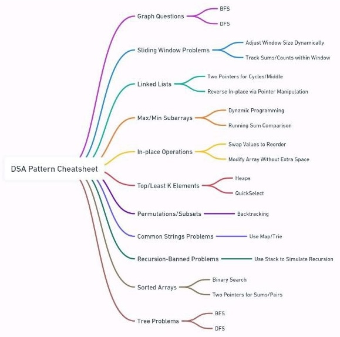

# Datastructure

## What is Data structure?
- Organising data in organised way. for example if you need cooper wire from store..if they are in messed up with other wires it will be very hard to find that.. but in our daily store they orgainsed in way..so that's data structure

## What is Alogithm?
- Set of rules to solve a problem
ex: for making a tea.. you have to put water, tea leaves, milk , sugar..and then put it on stove.. so these are set of rules to solve a problem.and here problem is to make a tea.

## Types of Data structure
[![](https://mermaid.ink/img/eyJjb2RlIjoiZ3JhcGggVERcbiAgICBBKERhdGFTdHJ1Y3R1cmUpIC0tPiBCKFByaW1pdGl2ZSBEYXRhIFN0cnVjdHVyZSlcbiAgICBBKERhdGFTdHJ1Y3R1cmUpIC0tPiBHKE5vbiBQcmltaXRpdmUgRGF0YSBTdHJ1Y3R1cmUpXG4gICAgQihQcmltaXRpdmUgRGF0YSBTdHJ1Y3R1cmUpIC0tPiBDKEludGVnZXIpXG4gICAgQihQcmltaXRpdmUgRGF0YSBTdHJ1Y3R1cmUpIC0tPiBEKEZsb2F0KVxuICAgIEIoUHJpbWl0aXZlIERhdGEgU3RydWN0dXJlKSAtLT4gRShDaGFyYWN0ZXIpXG4gICAgQihQcmltaXRpdmUgRGF0YSBTdHJ1Y3R1cmUpIC0tPiBGKEJvb2xlYW4pXG4gICAgRyhOb24gUHJpbWl0aXZlIERhdGEgU3RydWN0dXJlKSAtLT4gSChMaW5lYXIgRGF0YSBTdHJ1Y3R1cmUpXG4gICAgRyhOb24gUHJpbWl0aXZlIERhdGEgU3RydWN0dXJlKSAtLT4gSShOb24tTGluZWFyIERhdGEgU3RydWN0dXJlKVxuICAgIEgoTGluZWFyIERhdGEgU3RydWN0dXJlKSAtLT4gSihBcnJheSlcbiAgICBIKExpbmVhciBEYXRhIFN0cnVjdHVyZSkgLS0-IEsoTGlua2xpc3QpXG4gICAgSChMaW5lYXIgRGF0YSBTdHJ1Y3R1cmUpIC0tPiBMKFN0YWNrKVxuICAgIEgoTGluZWFyIERhdGEgU3RydWN0dXJlKSAtLT4gTShRdWV1ZSlcbiAgICBJKE5vbi1MaW5lYXIgRGF0YSBTdHJ1Y3R1cmUpIC0tPiBPKFRyZWUpXG4gICAgSShOb24tTGluZWFyIERhdGEgU3RydWN0dXJlKSAtLT4gUChHcmFwaCkiLCJtZXJtYWlkIjp7InRoZW1lIjoiZGVmYXVsdCJ9LCJ1cGRhdGVFZGl0b3IiOmZhbHNlfQ)](https://mermaid-js.github.io/mermaid-live-editor/#/edit/eyJjb2RlIjoiZ3JhcGggVERcbiAgICBBKERhdGFTdHJ1Y3R1cmUpIC0tPiBCKFByaW1pdGl2ZSBEYXRhIFN0cnVjdHVyZSlcbiAgICBBKERhdGFTdHJ1Y3R1cmUpIC0tPiBHKE5vbiBQcmltaXRpdmUgRGF0YSBTdHJ1Y3R1cmUpXG4gICAgQihQcmltaXRpdmUgRGF0YSBTdHJ1Y3R1cmUpIC0tPiBDKEludGVnZXIpXG4gICAgQihQcmltaXRpdmUgRGF0YSBTdHJ1Y3R1cmUpIC0tPiBEKEZsb2F0KVxuICAgIEIoUHJpbWl0aXZlIERhdGEgU3RydWN0dXJlKSAtLT4gRShDaGFyYWN0ZXIpXG4gICAgQihQcmltaXRpdmUgRGF0YSBTdHJ1Y3R1cmUpIC0tPiBGKEJvb2xlYW4pXG4gICAgRyhOb24gUHJpbWl0aXZlIERhdGEgU3RydWN0dXJlKSAtLT4gSChMaW5lYXIgRGF0YSBTdHJ1Y3R1cmUpXG4gICAgRyhOb24gUHJpbWl0aXZlIERhdGEgU3RydWN0dXJlKSAtLT4gSShOb24tTGluZWFyIERhdGEgU3RydWN0dXJlKVxuICAgIEgoTGluZWFyIERhdGEgU3RydWN0dXJlKSAtLT4gSihBcnJheSlcbiAgICBIKExpbmVhciBEYXRhIFN0cnVjdHVyZSkgLS0-IEsoTGlua2xpc3QpXG4gICAgSChMaW5lYXIgRGF0YSBTdHJ1Y3R1cmUpIC0tPiBMKFN0YWNrKVxuICAgIEgoTGluZWFyIERhdGEgU3RydWN0dXJlKSAtLT4gTShRdWV1ZSlcbiAgICBJKE5vbi1MaW5lYXIgRGF0YSBTdHJ1Y3R1cmUpIC0tPiBPKFRyZWUpXG4gICAgSShOb24tTGluZWFyIERhdGEgU3RydWN0dXJlKSAtLT4gUChHcmFwaCkiLCJtZXJtYWlkIjp7InRoZW1lIjoiZGVmYXVsdCJ9LCJ1cGRhdGVFZGl0b3IiOmZhbHNlfQ)

## Recursion
calling same method again and again

ex. 
- finding factorial
- finding fibonacci

### comparision recursion and iteration
| Ways  | Recursion better  | Iteration better| Description |
| :------------: |:---------------:| :-----:| :-----:|
| Space Complexity     | No | Yes | Interally system is using stack as memory but for iteration we are using variables |
| Time Complexity     | No        | Yes | System is using stack in recursion so it will take time to push and pop |
| Ease of code (to solve subproblem) | Yes       |   No | When there is case when we can divide the problem in simlar problems then Recursion will help to divide in subproblems which is better approch |


### When to avoid and use Recursion
- When we can divide problem into simlar problems then we have to use recursion
- when there is no bound for time and space then we can use recursion. for example we have to program for air bag..in which case time is crucial point and another example embedded system where storage is important point.. so at these places we have to avoid using recursion

### Practical uses
- stack
- Tree - Traversal/Insertion/Deletion/Searching
- Sorting - Quick and Merge sort
- Divide and conqur
- Dynamic Programming and many more.

## Algorithm Run Time Analysis
Study of given alogo's running time by increasing input size or simply we can say how much time alogo takes to run with different inputs. or Its a measurement of performance of given alogrithm

### Notations
- Omega(Ω)
  It will give Lower bound of algo.
  
  for example , entry of 10k elements will not be less then 10 sec, it will be more than 10 sec like 11 sec , 12 sec
  
  case where we may need it : when we have allocate resources.

- Big-O(O)
  It will give upper bound of alog. (worst case and best case both measured)
  
  for example , entry of 10k elements will not take more than 100 secs , it will be less like 92, 90 sec
  
  case where we may need it : programming air bag system.In this case we have to be known in worst case how much time it will take to deploy air bag.
  
- Theta (0)
  It will give averge time of an algo. or we can say upper bound and lower bound of an alogrithm are same or not
  
  for example , entry of 10k elements with various input gives different output ex 10,50,100 so theta is near about 50 as average.
  

### Example:
5,2,4,...lakhs,1,10  given that it will take 1 unit of time to check number

Omega(Ω) = seaching minimum time : 1 unit to search 5 so Ω is `Ω(1)`

Big-O(O) = let total number is `n` , so finding number 10 will take n units of time so `O(n)`

Theta (0) =   average time : n/2 so `0(n/2)`


# How to Start

### Learn Basic of
#### your langauge
ex variables,DataTypes,Loops,if/Else,Array/Strings,Functions/Classes,Input/Output Operations

#### Space and Time Complixity , Big O notation

#### Datastructure : Arrays,Strings,LinkList,STacks,Queue,Hashtable,

#### ALGOs

ex.Sortings,Binary Search , Recursion 

Binary Tree [youtubeLink](https://youtu.be/Qmt0QwzEmh0?si=F9ampCBr4kUuOk27)
[Abdul Bari youtube](https://youtu.be/-qOVVRIZzao?si=U9lch-as-qyPCt-1) and 

DSA Patterns [Algo Master youtube link](https://youtu.be/QzZ7nmouLTI?si=3WiO_u_mdZ1Gat1p)

Solve Leet code problems , start with easy then move on to Medium
you can go with buckets created by leetcode for iterviews.

you can practice pattern list by going [algomaster](https://algomaster.io/practice/dsa-patterns) and select pattern and `i` there is link to learn also. its very usefull

Most common Pattern List
- Prefix Sum
- Two Pointer
- Sliding Window
- Fast and Slow Pointer
- LinkList in-place reversal
- Monotonic Stack
- Top K elements
- Overlapping intervals
- Modified Binary Tree
- Binary tree traversal
- DFS
- BFS
- Mattrix Traversal
- BackTracking



Company Wise Leet code problem list [github](https://github.com/krishnadey30/LeetCode-Questions-CompanyWise)


### Sortings(with time and space complexity)

|ALGO|Best|Wors|Space|
|--|--|--|--|
|Bubble Sort|  `O(n)`| `O(n^2)`||
| Insertion Sort | `O(n)`| `O(n^2)` ||
|Merge Sort |`O(nlogn)`| `O(nlogn)`| `O(n)`|
| Quick Sort | `O(nlogn)`|`O(n^2)`|`O(logn)`|
|Selection Sort |`O(n^2)`| `O(n^2)`||


# Array
Time Complexity : 
|Doing|Time|
|--|--|
|Inserting|O(n)|
|Deleting|O(n)|
|Read|O(1)|

# LinkList
Time Complexity : 
|Doing|Time|
|--|--|
|Inserting at first |O(1)|
|Inserting at Last |O(n)|
|Deleting at first|O(1)|
|Deleting at last |O(n)|
|Read at first|O(1)|
|Read at last |O(n)|
# HashMap
Time Complexity : 
|Doing|Time|
|--|--|
|Inserting|O(1)|
|Deleting|O(1)|
|Read|O(1)|

# Stacks (LIFO)
Time Complexity : 
|Doing|Time|
|--|--|
|Push|O(1)|
|Pop|O(1)|
|peek(read first element)|O(1)|

# Queue (FIFO)
Time Complexity : 
|Doing|Time|
|--|--|
|Enqueue(Adding)|O(1)|
|Dequeue(Deleting)|O(1)|
|Front(Read)|O(1)|


# Trees
Binary Search Tree: Time complexity = O(logn)

DFS: depth first search
Time complexity : O(Nodes+branches)
Usefull : to solve maze

BFS: breath first search
Time complexity : O(Nodes+branches)
Usefull : for chess algos
checking for possible moves and then checking again from those possible moves
# Graphs

Usefull:
to find nearest store to you

# Greedy ALGO
it check what is best at that point not overall so its not used for efficieny
ex : https://youtu.be/kp3fCihUXEg?list=PLUITAQK78D8PByrC3XDuF-elzSK7QWXO5&t=1009

so if problem is very complex and you don't want exact outcome then use greedy
ex [Travelling salesman problem](https://youtu.be/kp3fCihUXEg?list=PLUITAQK78D8PByrC3XDuF-elzSK7QWXO5&t=1119) 


## Details of Algos
### BST
Binary Tree having upto 2 child nodes
Binary search tree is type of Binary Tree having left `nodes` is less than parent node and right `nodes` is greater than parent node.
lets take example : 
8(P)- 2(L)-15(R)
2(P)- 1(L)-10(R)

so this is not a BST because 10 is greater than 8 but its greater than 2 and right side of 2

so values Goes from -∞ to +∞
if parent is 8 then for left side values should be between -∞ to 8 and right side nodes should be between 8 to +∞

check its BST OR NOT - https://www.geeksforgeeks.org/problems/check-for-bst/1
insert node - https://www.geeksforgeeks.org/problems/insert-a-node-in-a-bst/1
Kth Smallest/Largest Element in BST  https://www.geeksforgeeks.org/problems/find-k-th-smallest-element-in-bst/1


### Strings
- Check a String is palindrome or not
- Remove any given character from a String
- Find out longest palindrome in a given string
- Find the first non repeated character of a given String
- Count the occurrence of a given character in a String
- Check if two String are Anagram
- Convert numeric String to int in Java
- Reverse words in a given string
```
 input :Hi I am vishal
 output: vishal am I Hi
```
- Permutations of a given string
```
input : ABC
output : ABC ACB BAC BCA CAB CBA 
```
- Check if string is rotated by certain number then we get original string
```
input : 3
vishal
halvis
output: yes
```
- Remove Duplicate char from string
  
----
### LinkList
- `!` [ Insert Element at first](algorithms/singlelinklist.md)
- `!`[ Inserting node at nth position](algorithms/singlelinklist.md)
- `!`[ Delete Node at nth position](algorithms/singlelinklist.md)
- `!`[ Reverse a linked list with recursion ](algorithms/singlelinklist.md)
- `!`[ Reverse a linked list without recursion](algorithms/singlelinklist.md)
- `!`[ Implement stack using Linklist](algorithms/singlelinklist.md)
- [Find the 4th node from the end in a singly linked list](algorithms/singlelinklist.md)
- [Find the middle element of a singly linked list in one pass](algorithms/singlelinklist.md)
- [Check if a given linked list contains a cycle/loop?find the starting node of the cycle and remove the loop ](algorithms/singlelinklist.md)
- Find Merge point of Two singly linklist
- Remove duplicate nodes in an unsorted linked list
- Find the sum of two linked lists using Stack
- Rotate a Linked List
- Reverse a Linked List in groups of given size
  ```
  input : 2
  1234
  output: 2143
  ```
- Merge two sorted linked lists and final output is sorted
- Add two numbers represented by linked lists
  ```
  input:
  1->2
  3->4
  output: 4>6 (sum of 12 + 34 =46)
  ```
- Check if Linked List is Palindrome
- Implement Queue using Linked List
- Implement Stack using Linked List
- Given a linked list of 0s, 1s and 2s, sort it
- Delete without head pointer and printing function is given
  ```
  input : 5 
          1234567
  output: 123467
  ```
### Doubly LinkList
- ! Insert at first

  ---
### Tree
- Binary tree in preorder with and without recursion
- Count a number of leaf nodes in a given binary tree
- Perform a binary search in a given array
- Find the depth of a binary tree
- [Find Height of Binary Tree ](https://practice.geeksforgeeks.org/problems/height-of-binary-tree/1) 
- Print InOrder , postorder,preorder traversal of a BT with and without recursion
- Check if a Binary tree is a BST or not
- Tree is balanced or not   
- [Print Left View of Binary Tree](https://practice.geeksforgeeks.org/problems/left-view-of-binary-tree/1)
- [Print Bottom View of Binary Tree  ](https://practice.geeksforgeeks.org/problems/bottom-view-of-binary-tree/1)
- [Print a Binary Tree in Vertical Order](https://practice.geeksforgeeks.org/problems/print-a-binary-tree-in-vertical-order/1)
- [Level order traversal in spiral form  ](https://practice.geeksforgeeks.org/problems/level-order-traversal-in-spiral-form/1)
- [Lowest Common Ancestor in a BST](https://practice.geeksforgeeks.org/problems/lowest-common-ancestor-in-a-bst/1)
- [Convert a given Binary Tree to Doubly Linked List](https://practice.geeksforgeeks.org/problems/binary-tree-to-dll/1)
- [Write Code to Determine if Two Trees are Identical or Not ](https://practice.geeksforgeeks.org/problems/determine-if-two-trees-are-identical/1)
- [Given a binary tree, check whether it is a mirror of itself ](https://practice.geeksforgeeks.org/problems/symmetric-tree/1)
- [Maximum Path Sum ](https://practice.geeksforgeeks.org/problems/maximum-path-sum/1)
- [Diameter of a Binary Tree ](https://practice.geeksforgeeks.org/problems/diameter-of-binary-tree/1)
- [Check if given Binary Tree is Height Balanced or Not](https://practice.geeksforgeeks.org/problems/check-for-balanced-tree/1)
- [Serialize and Deserialize a Binary Tree](https://practice.geeksforgeeks.org/problems/serialize-and-deserialize-a-binary-tree/1)
  


## Reference : 
https://emre.me/categories/#coding-patterns
https://www.youtube.com/@codefromscratch-keertipurswani/playlists
https://www.youtube.com/watch?v=QzZ7nmouLTI&list=PLCZ2MME8uzMidVBgvIYq99C0VJ9a0gG7U&ab_channel=AlgoMasterIO