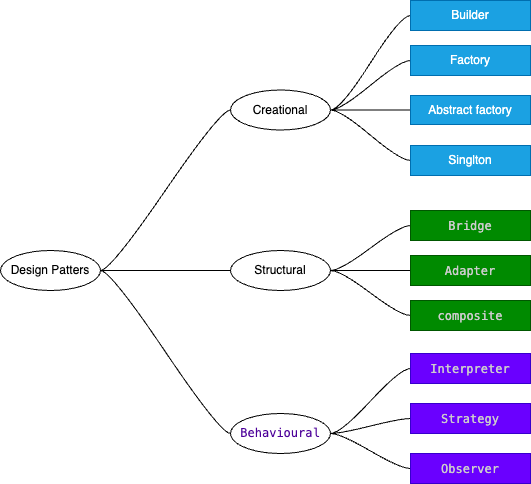
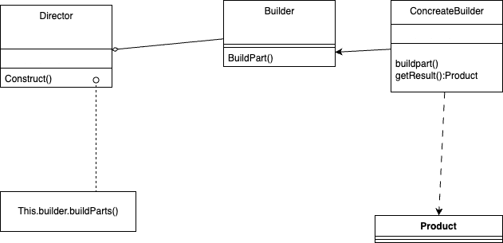
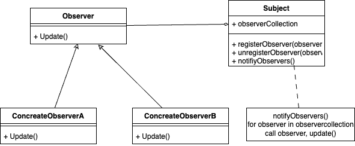

# Design Pattern



<ins>Definition</ins> : its a general repeatable solution to a commonly occurring problem in software design. A design pattern isn't a finished design that can be transformed directly into code. It is a description or template for how to solve a problem that can be used in many different situations.

## Types:

- Creational : creating of objects and clases
- Structural : how to structure the these objects and classes ex. Bridge, Adapter, composite
- Behavioural : how these classes and objects will communicate with each other. ex. Interpreter, Strategy, Observer


### Quick idea of patterns : 

1. <a href="#singlton">!Singleton:</a> Ensures only one instance exists.
1. <a href="#factory">!Factory Method: </a> Delegates object instantiation to subclasses.
1. <a href="#abstract-factory-design-patternafdp">!Abstract Factory:</a> Creates related object families without specifying their concrete classes.
1. Prototype: Clones objects for a prototypical instance.
1. <a href="#builder">!Builder:</a> Constructs complex objects step by step.
1. <a href="#adapter-design-patternadp">!Adapter:</a> Bridges incompatible interfaces.
1. <a href="#observer">!Observer:</a> Notifies changes to multiple objects.
1. !Decorator: Adds behaviors to objects dynamically.
1. <a href="#strategy">!Strategy:</a> Encapsulates interchangeable algorithms.
1. <a href="Chain of Responsibility">!Chain of Responsibility</a>: Passes requests along a chain of handlers.
1. Proxy: Controls object access.
1. Bridge: Separates abstraction from implementation.
1. !Composite: Treats single and composite objects uniformly.
1. !Facade: Simplifies complex system interfaces.
1. Flyweight: Shares objects to reduce memory.
1. !Command: Encapsulates a request as an object.
1. !State: Changes object behavior with internal state.
1. Visitor: Adds operations to object structures without modifying them.
1. Memento: Captures and restores object states externally.
1. Iterator: Sequentially accesses elements of a collection.
1. Mediator: Centralizes complex communications.
1. !Template Method: Defines the skeleton of an algorithm.


## Factory:
Library should be responsible to decide which obj type to create based on input
Client should just call lib factory and pass the type without worry about actual implementation of creation of object.
ex. 
```java

abstract class Vechile{
    public abstract void createvechile();
}
class car extends Vechile{
    public void createvechile(){
        print("createvechile: Car")
    }
}
class bike extends Vechile{
    public void createvechile(){
        print("createvechile: bike")
    }
}


// client 

class main(){

    //inputtype : car or bike
    String type ;
    Vechile vechile = null;
    if(type =="car"){
        vechile = new Car()
    }
    if(type =='bike'){
        vechile = new Bike()
    }
}
```

better way 

```java
abstract class Vechile{
    public abstract void createvechile();
}
class car extends Vechile{
    public void createvechile(){
        print("createvechile: Car")
    }
}
class bike extends Vechile{
    public void createvechile(){
        print("createvechile: bike")
    }
}
class VechileFactory{
    public static Vechile getVechile(String type){
    Vechile vechile = null;
    if(type =="car"){
        vechile = new Car()
    }
    if(type =='bike'){
        vechile = new Bike()
    }
    }
    return vechile;
}


// client 

class main(){

    //inputtype : car or bike
    String type ;
    Vechile vechile = VechileFactory.getVechile(type); // client doesn't know about implementation and client doesn't need to change the code in future if bus and tempo is introduced.we need to make changes in Lib only.
    vechile.createVechile();

}

```

## Singlton:

- single object should be created for the class.
- constructor should be **private**.
- mainly used with db connections, loggers
- It should be **thread safe**
- put double check for null instance one before lock and one after lock  
- Keep in mind that locking is expensive.
- Make copy constructor as private
- Make equalto overloading as private
- In c++ , you have to make equaltodelete also as private


## Builder:

we use when object is very complex and having lot of configurations to build .
ex. to build house , we need interior , pipline, gas,ac




in below example we are creating desktop


- Product = Desktop or Vehicle
- Builder = DesktopBuilder or VehicleBuilder(abstract interface for creating parts of a product object)
- ConcreateBuilder = DellDesktop and HpDesktop or (MotorcyclineBuilder, CarBuilder , ScooterBuilder)
    - constructs and assembles parts of the product by implementing the Builder interface
    - defines and keeps track of the representation it creates
    - provides an interface for retrieving the product

- Director = Is responsible to generate the product ie. civil enginer while constructor of house who guides everyone what to do and what steps they have to follow.
    - Construct an object using the Builder interface

```java

class Desktop{
    var monitor:String = "";
    var keyboard:String = "";
    var mouse:String = "";

    fun showspecs(){
        println("Monitor: $monitor")
        println("Keyboard: $keyboard")
        println("Mouse: $mouse")
    }
}

abstract class DesktopBuilder(val desktop: Desktop = Desktop()) {
   abstract fun buildMonitor ():DesktopBuilder
    abstract fun buildKeyboard ():DesktopBuilder
    abstract fun buildMouse ():DesktopBuilder
    fun getDesktopFromBuilder(): Desktop{
        return desktop
    }
}

class DellDesktopBuilder: DesktopBuilder(){
    override fun buildMonitor(): DellDesktopBuilder {
        desktop.monitor = "Dell Monitor"
        return this
    }

    override fun buildKeyboard() :DellDesktopBuilder{
        desktop.keyboard = "Dell Keyboard"
        return this
    }

    override fun buildMouse():DellDesktopBuilder {
        desktop.mouse = "Dell Mouse"
        return this
    }

}

class HpDesktopBuilder: DesktopBuilder(){
    override fun buildMonitor() :HpDesktopBuilder{
        desktop.monitor = "Hp Monitor"
        return this
    }

    override fun buildKeyboard() :HpDesktopBuilder{
        desktop.keyboard = "Hp Keyboard"
        return this
    }

    override fun buildMouse():HpDesktopBuilder {
        desktop.mouse = "Hp Mouse"
        return this
    }

}

class Director(_builder: DesktopBuilder){
    var builder : DesktopBuilder = _builder

    fun BuildDesktop(): Desktop{
        builder.buildMonitor()
        builder.buildKeyboard()
        builder.buildMouse()
        return  builder.getDesktopFromBuilder()
    }
    
    fun buildDesktop2(): Desktop{
       return builder.buildMonitor().
       buildKeyboard().
       getDesktopFromBuilder()
    }

}

fun main(){

    val dellDesktopBuilder = DellDesktopBuilder()
    val director = Director(dellDesktopBuilder)
    val desktop = director.BuildDesktop()
    desktop.showspecs()

    val hpDesktopBuilder = HpDesktopBuilder()
    val directorDiff = Director(hpDesktopBuilder)
    directorDiff.buildDesktop2().showspecs()
}

main()

```


## OBSERVER

With one data change with have to run multiple services or do tasks on multiple services.
we can say that lot of people are observing one person.so this one person is subject and other are observers.

When there is change in subject all observers will get to know that.


example
1) you have logged in to multiple devices for email. now whenever some mail comes , you need to notify all these devices.
2) In group chat,  we have to notify all users of that group.



```java 

interface ISubscribe {
    fun notifynotifyMyObservers()
}

class Subject {
    private val subscribers = mutableListOf<ISubscribe>()

    fun subscribe(observer: ISubscribe) {
        subscribers.add(observer)
    }

    fun unsubscribe(observer: ISubscribe) {
        subscribers.remove(observer)
    }

    fun notifyMy() {
        subscribers.forEach { it.notifynotifyMyObservers() }
    }
}


class Observer(val _id: Int) : ISubscribe {
    var id: Int = _id
    override fun notifynotifyMyObservers() {
        println("User $id has been notified")
    }
}

class main() {
    val observer1 = Observer(1)
    val observer2 = Observer(2)
    var mySubject = Subject()

    init {
        mySubject.subscribe(observer1)
        mySubject.subscribe(observer2)
        mySubject.notifyMy()
        println("removing user 2 from notification as he left the group")
        mySubject.unsubscribe(observer2)
        mySubject.notifyMy()
    }
}

main()
```


## Abstract Factory Design Pattern(AFDP)


Main question comes what is difference between factory and abstract factory : 
so factory design patter is creating concreate classes or objects and Abstract factory design pattern is going to create factories that is going to create objects basically AFDP is going to create a family of classes.


```java
class main() {
    //    var osType = "windows"
    var osType = "mac"

    fun createUI() {
        val factory = MainFactory.createFactory(osType)
        val button = factory.createButton()
        val textBox = factory.createTextBox()
        button.press()
        textBox.show()
    }
}

main().createUI()

class MainFactory(val os: String) {
    companion object {
        fun createFactory(os: String): IFactory {
            when (os) {
                "windows" -> return WindowsFactory()
                "mac" -> return MacFactory()
            }
            return WindowsFactory()
        }
    }
}

interface IFactory {
    fun createButton(): IButton
    fun createTextBox(): ITextBox
}

class WindowsFactory : IFactory {
    override fun createButton(): IButton {
        return WindowsButton()
    }
    override fun createTextBox(): ITextBox {
        return WindowsTextBox()
    }
}

class MacFactory : IFactory {
    override fun createButton(): IButton {
        return MacButton()
    }
    override fun createTextBox(): ITextBox {
        return MacTextBox()
    }
}

interface IButton {
    fun press()
}

interface ITextBox {
    fun show()
}

class WindowsButton : IButton {
    override fun press() {
        println("Windows Button Pressed")
    }
}

class MacButton : IButton {
    override fun press() {
        println("Mac Button Pressed")
    }
}

class WindowsTextBox : ITextBox {
    override fun show() {
        println("Windows TextBox Showed")
    }
}

class MacTextBox : ITextBox {
    override fun show() {
        println("Mac TextBox Showed")
    }
}
```

## Adapter Design Pattern(ADP)

example: 
we have plug and plug points, when indian people goes in Europe, there plug points are different. so they cannot charge the phones.
To work with them we need to have some instrument which will take our charger point and output the desired plug which is used in europe. 
So we our charger will work. This instrument we call adapters.

Adapters are converting one thing to another. 

example 2 : there is tool which is taking json but our data is xml. so we create adapter which will convert xml to json.


```java

class Main {
    val xmlData = XMLData("<data>hello</data>")
    //    val tool = Tool(xmlData.getXMLdata()) // gives error as its not json input
    val tool = ToolAdapterForJson(xmlData.getXMLdata())
    val client = client()
    fun run() {
        client.processData(tool)
    }
}
val m = Main()
m.run()

class XMLData(val data: String) {
    fun getXMLdata(): String { return data; }
}

open class Tool(val data: String) {
    open fun analysisData() { println("This should be json data : $data") }
}

class client {
    fun processData(tool: Tool) { tool.analysisData() }
}

class ToolAdapterForJson(data: String) : Tool(data) {
    override fun analysisData() {
        println("Convert xml to json data")
        println("analysis converted Json data $data")
    }
}
```


## Strategy 

The Strategy pattern defines a family of algorithms, encapsulates each one, and makes them interchangeable. The context object delegates the behavior to the chosen strategy, allowing the algorithm to be selected at runtime.

Behavioral Pattern

Primary Purpose	: 	Encapsulates interchangeable algorithms or behaviors

What it Does	:	Allows runtime selection and switching of algorithms

How it Works	:	Defines a family of algorithms, encapsulates each one, and makes them interchangeable within a context object

Example Use Case	:	Choosing different sorting algorithms or payment methods at runtime

Key Components	: Context, Strategy interface, Concrete strategies
Focus	How operations are performed


### Confused with Factory ? 

Real-Time Android Examples: Factory vs. Strategy Pattern

Below are two real-world Android use cases—one for the Factory pattern and one for the Strategy pattern—demonstrating scenarios where they cannot be replaced by each other.

1. Factory Pattern Example: Notification Creation

#### Scenario:
You need to create different types of notifications (Email, SMS, Push) in your app. The notification type is determined at runtime, and each type requires different logic and resources.

#### Implementation:

- Define a Notification interface.

- Implement concrete classes: EmailNotification, SMSNotification, PushNotification.

- Use a NotificationFactory to return the appropriate notification object based on input.

##### Why Strategy Won't Work Here:
The Factory pattern is about which object to create. The client doesn't know or care about the specific subclass; it just requests a notification of a given type. If you used Strategy here, you'd have to manually instantiate the correct notification type outside the factory, defeating the purpose of decoupling object creation logic from client code


```kotlin

interface Notification { fun notifyUser() }
class EmailNotification : Notification { override fun notifyUser() { /* Email logic */ } }
class SMSNotification : Notification { override fun notifyUser() { /* SMS logic */ } }
class PushNotification : Notification { override fun notifyUser() { /* Push logic */ } }

object NotificationFactory {
    fun create(type: String): Notification = when(type) {
        "EMAIL" -> EmailNotification()
        "SMS" -> SMSNotification()
        "PUSH" -> PushNotification()
        else -> throw IllegalArgumentException("Unknown type")
    }
}

// Usage
val notification = NotificationFactory.create("EMAIL")
notification.notifyUser()


```

##### Cannot Replace with Strategy:
If you used Strategy, you'd still need to explicitly instantiate the correct notification class yourself, losing the decoupling and centralization of creation logic that Factory provides.


2. Strategy Pattern Example: Image Loading with Different Caching Strategies

##### Scenario:
You have an image loader in your app. Depending on user settings or network conditions, you want to switch between different caching strategies (e.g., memory cache, disk cache, no cache) at runtime.

##### Implementation:

- Define a CacheStrategy interface.

- Implement concrete strategies: MemoryCacheStrategy, DiskCacheStrategy, NoCacheStrategy.

- The ImageLoader class holds a reference to a CacheStrategy and delegates caching operations to it.

##### Why Factory Won't Work Here:
The Strategy pattern is about how to do something (the algorithm/behavior), not which object to create. The image loader object already exists and can change its caching behavior at runtime by swapping strategies. Factory cannot help you switch behaviors dynamically after the object is created.

```kotlin
interface CacheStrategy { fun cache(image: Bitmap) }
class MemoryCacheStrategy : CacheStrategy { override fun cache(image: Bitmap) { /* Memory caching */ } }
class DiskCacheStrategy : CacheStrategy { override fun cache(image: Bitmap) { /* Disk caching */ } }
class NoCacheStrategy : CacheStrategy { override fun cache(image: Bitmap) { /* No caching */ } }

class ImageLoader(var cacheStrategy: CacheStrategy) {
    fun load(image: Bitmap) { cacheStrategy.cache(image) }
}

// Usage
val imageLoader = ImageLoader(MemoryCacheStrategy())
imageLoader.load(bitmap)
// Switch strategy at runtime
imageLoader.cacheStrategy = DiskCacheStrategy()
imageLoader.load(bitmap)
```
##### Cannot Replace with Factory:
Factory is for creating objects, not for switching behaviors of an existing object. You need Strategy to dynamically change how an object behaves at runtime.

##### Summary 
| Pattern| Android Example| What It Solves| Why Not the Other Pattern?|
|--|--|--|--|
| Factory|NotificationFactory (Email/SMS/Push) |Decides which object to create | Strategy doesn't centralize creation logic|
| Strategy| ImageLoader with CacheStrategy| Switches behavior of existing object|Factory can't change behavior after creation |
	
			
### In essence:

- Use Factory when you need to centralize and abstract object creation.

- Use Strategy when you want to change the behavior of an existing object at runtime.
    They solve fundamentally different problems and are not interchangeable in these real-world Android scenarios


# Chain of Responsibility (Behavioral Design Pattern)

Questions comes like ATM , Vending Machine, Logger


Real Example of Android : 
- Touch Event Hanlding in view Hierachy
- Okhttp Interceptors
```kotlin
class LoggingInterceptor implements Interceptor {
    @Override
    public Response intercept(Chain chain) throws IOException {
        Request request = chain.request(); // Receive request
        Log.d("Request", request.url().toString());

        Response response = chain.proceed(request); // Pass to next
        return response; // Can also modify before returning
    }
}

```
- Jetpack Compose Modifiers
    ```kotlin 
    Modifier
    .padding(16.dp)
    .clickable { /* handle click */ }
    .background(Color.Red)
    ```


```kotlin

class Main(){
    val loghandler:LogHandler = InfoLog(DebugLog(ErrorLog(null)))
    loghandler.log(INFO,"just info")
    loghandler.log(DEBUG,"dubug log")
    loghandler.log(ERROR,"Exception hanlded")
}

abstract class LogHandler(protected val nextLoghanlder:LogHandler?){
    val INFO = 1
    val DEGUG = 2
    val ERROR = 3

    fun log(log_level : Int , message:String){
        if(nextLogHandler!=null){
            nextLogHandler.log(log_level, message);
        }
    }
}

class InfoLog(LogHandler nextloghandler) : LogHandler(nextloghandler){
    fun log(level:Int,message:String){
        if(level == INFO){
            println("INfo logs")
        }
        else{
            super.log(level,message)
        }
    }
}
class DebugLog(LogHandler nextloghandler) : LogHandler(nextloghandler){
    fun log(level:Int,message:String){
        if(level == Debug){
            println("Debug logs")
        }
        else{
            super.log(level,message)
        }
    } 
}
class ErrorLog(LogHandler nextloghandler) : LogHandler(nextloghandler){
    fun log(level:Int,message:String){
        if(level == Error){
            println("Error logs")
        }
        else{
            super.log(level,message)
        }
    }
}

```


# Proxy Design Pattern

Think of it like a security guard at a building entrance:
You want to enter the real building (real object), but first, the guard (proxy) checks your ID and permissions. If you're good, you're let in.

> A Proxy is a class that acts as a stand-in or placeholder for another class. It controls access to the real object — either by delaying its creation, controlling access, or adding extra behavior like logging or caching.


### When to Use
- Caching API data
- Access control based on user roles
- Logging or analytics wrappers
- Lazy-loading heavy resources (e.g., images, files)
- Adding retry mechanisms without altering the core logic

### Example 
You're calling the API directly. There's no caching. Every time you request the data, it hits the server.

```kotlin 
// Without Proxy
interface ApiService {
    @GET("user")
    suspend fun getUser(): User
}

class UserRepository(private val apiService: ApiService) {

    suspend fun fetchUser(): User {
        return apiService.getUser() // always hits the network
    }
}

```
Result : 
- Every call → hits the server.
- No caching.
- Wastes network/data/time if user data doesn’t change frequently.

```kotlin
// With Proxy
interface ApiService {
    @GET("user")
    suspend fun getUser(): User
}

class CachedApiService(private val realService: ApiService) : ApiService {

    private var cachedUser: User? = null

    override suspend fun getUser(): User {
        return cachedUser ?: realService.getUser().also {
            cachedUser = it
        }
    }
}

class UserRepository(apiService: ApiService) {
    private val cachedService = CachedApiService(apiService)

    suspend fun fetchUser(): User {
        return cachedService.getUser()
    }
}

```

| Without Proxy                  | With Proxy                          |
| ------------------------------ | ----------------------------------- |
| Directly calls `apiService`    | Calls `CachedApiService` first      |
| No caching                     | Adds caching logic                  |
| No control over extra behavior | Can log, cache, retry inside proxy  |
| No separation of concerns      | Proxy handles "extra" logic cleanly |


###  How to Think About It
- ✅ Real Object (ApiService) → Does the actual work
- ✅ Proxy (CachedApiService) → Adds logic like caching before delegating to the real object
- ✅ Caller (UserRepository) → Thinks it's talking to ApiService, but actually using the proxy


### Commnon Mistakes
| Mistake                             | Tip to Avoid                                           |
| ----------------------------------- | ------------------------------------------------------ |
| Mixing proxy logic with real object | Keep proxy and real class **separate and independent** |
| Not following interface contract    | Proxy must **implement the same interface**            |
| Overusing proxy (overengineering)   | Use when there's a **clear need for extra behavior**   |


# Reference : 

https://sourcemaking.com/design_patterns
https://github.com/pdichone/JavaDesignPatterns

Course : https://www.coursera.org/learn/design-patterns#modules

