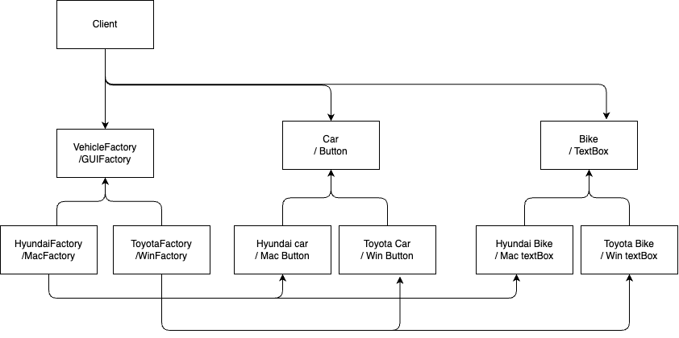

# Design Pattern


Defination : its a general repeatable solution to a commonly occurring problem in software design. A design pattern isn't a finished design that can be transformed directly into code. It is a description or template for how to solve a problem that can be used in many different situations.

Types:

- Creational : creating of objects and clases
- Structural : how to structure the these objects and classes ex. Bridge, Adapter, composite
- Behavioural : how these classes and objects will communicate with each other. ex. Interpreter, Strategy, Observer


Quick idea of patterns : 

1. Singleton: Ensures only one instance exists.
2. Factory Method: Delegates object instantiation to subclasses.
3. Abstract Factory: Creates related object families without specifying their concrete classes.
4. Prototype: Clones objects for a prototypical instance.
5. Builder: Constructs complex objects step by step.
6. Adapter: Bridges incompatible interfaces.
7. Bridge: Separates abstraction from implementation.
8. Composite: Treats single and composite objects uniformly.
9. Decorator: Adds behaviors to objects dynamically.
10. Facade: Simplifies complex system interfaces.
11. Flyweight: Shares objects to reduce memory.
12. Proxy: Controls object access.
13. Observer: Notifies changes to multiple objects.
14. Strategy: Encapsulates interchangeable algorithms.
15. Command: Encapsulates a request as an object.
16. State: Changes object behavior with internal state.
17. Visitor: Adds operations to object structures without modifying them.
18. Memento: Captures and restores object states externally.
19. Iterator: Sequentially accesses elements of a collection.
20. Mediator: Centralizes complex communications.
21. Chain of Responsibility: Passes requests along a chain of handlers.
22. Template Method: Defines the skeleton of an algorithm.


__Factory:__
Library should be responsible to decide which obj type to create based on input
Client should just call lib factory and pass the type without worry about actual implementation of creation of object.
ex. 
```java

abstract class Vechile{
    public abstract void createvechile();
}
class car extends Vechile{
    public void createvechile(){
        print("createvechile: Car")
    }
}
class bike extends Vechile{
    public void createvechile(){
        print("createvechile: bike")
    }
}


// client 

class main(){

    //inputtype : car or bike
    String type ;
    Vechile vechile = null;
    if(type =="car"){
        vechile = new Car()
    }
    if(type =='bike'){
        vechile = new Bike()
    }
}
```

better way 

```java
abstract class Vechile{
    public abstract void createvechile();
}
class car extends Vechile{
    public void createvechile(){
        print("createvechile: Car")
    }
}
class bike extends Vechile{
    public void createvechile(){
        print("createvechile: bike")
    }
}
class VechileFactory{
    public static Vechile getVechile(String type){
    Vechile vechile = null;
    if(type =="car"){
        vechile = new Car()
    }
    if(type =='bike'){
        vechile = new Bike()
    }
    }
    return vechile;
}


// client 

class main(){

    //inputtype : car or bike
    String type ;
    Vechile vechile = VechileFactory.getVechile(type); // client doesn't know about implementation and client doesn't need to change the code in future if bus and tempo is introduced.we need to make changes in Lib only.
    vechile.createVechile();

}

```

__Singlton:__

- single object should be created for the class.
- constructor should be **private**.
- mainly used with db connections, loggers
- It should be **thread safe**
- put double check for null instance one before lock and one after lock because locking is expensive.
- Make copy constructor as private
- Make equalto overloading as private
- In c++ , you have to make equaltodelete also as private


__Builder:__

we use when object is very complex and having lot of configurations to build .
ex. to build house , we need interior , pipline, gas,ac


in below example we are creating desktop


- Product = Desktop or Vehicle
- Builder = DesktopBuilder or VehicleBuilder(abstract interface for creating parts of a product object)
- ConcreateBuilder = DellDesktop and HpDesktop or (MotorcyclineBuilder, CarBuilder , ScooterBuilder)
    - constructs and assembles parts of the product by implementing the Builder interface
    - defines and keeps track of the representation it creates
    - provides an interface for retrieving the product

- Director = Is responsible to generate the product ie. civil enginer while constructor of house who guides everyone what to do and what steps they have to follow.
    - Construct an object using the Builder interface

```java

class Desktop{
    var monitor:String = "";
    var keyboard:String = "";
    var mouse:String = "";

    fun showspecs(){
        println("Monitor: $monitor")
        println("Keyboard: $keyboard")
        println("Mouse: $mouse")
    }
}

abstract class DesktopBuilder(val desktop: Desktop = Desktop()) {
   abstract fun buildMonitor ():DesktopBuilder
    abstract fun buildKeyboard ():DesktopBuilder
    abstract fun buildMouse ():DesktopBuilder
    fun getDesktopFromBuilder(): Desktop{
        return desktop
    }
}

class DellDesktopBuilder: DesktopBuilder(){
    override fun buildMonitor(): DellDesktopBuilder {
        desktop.monitor = "Dell Monitor"
        return this
    }

    override fun buildKeyboard() :DellDesktopBuilder{
        desktop.keyboard = "Dell Keyboard"
        return this
    }

    override fun buildMouse():DellDesktopBuilder {
        desktop.mouse = "Dell Mouse"
        return this
    }

}

class HpDesktopBuilder: DesktopBuilder(){
    override fun buildMonitor() :HpDesktopBuilder{
        desktop.monitor = "Hp Monitor"
        return this
    }

    override fun buildKeyboard() :HpDesktopBuilder{
        desktop.keyboard = "Hp Keyboard"
        return this
    }

    override fun buildMouse():HpDesktopBuilder {
        desktop.mouse = "Hp Mouse"
        return this
    }

}

class Director(_builder: DesktopBuilder){
    var builder : DesktopBuilder = _builder

    fun BuildDesktop(): Desktop{
        builder.buildMonitor()
        builder.buildKeyboard()
        builder.buildMouse()
        return  builder.getDesktopFromBuilder()
    }
    
    fun buildDesktop2(): Desktop{
       return builder.buildMonitor().
       buildKeyboard().
       getDesktopFromBuilder()
    }

}

fun main(){

    val dellDesktopBuilder = DellDesktopBuilder()
    val director = Director(dellDesktopBuilder)
    val desktop = director.BuildDesktop()
    desktop.showspecs()

    val hpDesktopBuilder = HpDesktopBuilder()
    val directorDiff = Director(hpDesktopBuilder)
    directorDiff.buildDesktop2().showspecs()
}

main()

```


__OBSERVER:__

With one data change with have to run multiple services or do tasks on multiple services.
we can say that lot of people are observing one person.so this one person is subject and other are observers.

When there is change in subject all observers will get to know that.


example
1) you have logged in to multiple devices for email. now whenever some mail comes , you need to notify all these devices.
2) In group chat,  we have to notify all users of that group.


```java 

interface ISubscribe {
    fun notifynotifyMyObservers()
}

class Subject {
    private val subscribers = mutableListOf<ISubscribe>()

    fun subscribe(observer: ISubscribe) {
        subscribers.add(observer)
    }

    fun unsubscribe(observer: ISubscribe) {
        subscribers.remove(observer)
    }

    fun notifyMy() {
        subscribers.forEach { it.notifynotifyMyObservers() }
    }
}


class Observer(val _id: Int) : ISubscribe {
    var id: Int = _id
    override fun notifynotifyMyObservers() {
        println("User $id has been notified")
    }
}

class main() {
    val observer1 = Observer(1)
    val observer2 = Observer(2)
    var mySubject = Subject()

    init {
        mySubject.subscribe(observer1)
        mySubject.subscribe(observer2)
        mySubject.notifyMy()
        println("removing user 2 from notification as he left the group")
        mySubject.unsubscribe(observer2)
        mySubject.notifyMy()
    }
}

main()
```


__Abstract Factory Design Pattern(AFDP)__


Main question comes what is difference between factory and abstract factory : 
so factory design patter is creating concreate classes or objects and Abstract factory design pattern is going to create factories that is going to create objects basically AFDP is going to create a family of classes.



```java
class main() {
    //    var osType = "windows"
    var osType = "mac"

    fun createUI() {
        val factory = MainFactory.createFactory(osType)
        val button = factory.createButton()
        val textBox = factory.createTextBox()
        button.press()
        textBox.show()
    }
}

main().createUI()

class MainFactory(val os: String) {
    companion object {
        fun createFactory(os: String): IFactory {
            when (os) {
                "windows" -> return WindowsFactory()
                "mac" -> return MacFactory()
            }
            return WindowsFactory()
        }
    }
}

interface IFactory {
    fun createButton(): IButton
    fun createTextBox(): ITextBox
}

class WindowsFactory : IFactory {
    override fun createButton(): IButton {
        return WindowsButton()
    }
    override fun createTextBox(): ITextBox {
        return WindowsTextBox()
    }
}

class MacFactory : IFactory {
    override fun createButton(): IButton {
        return MacButton()
    }
    override fun createTextBox(): ITextBox {
        return MacTextBox()
    }
}

interface IButton {
    fun press()
}

interface ITextBox {
    fun show()
}

class WindowsButton : IButton {
    override fun press() {
        println("Windows Button Pressed")
    }
}

class MacButton : IButton {
    override fun press() {
        println("Mac Button Pressed")
    }
}

class WindowsTextBox : ITextBox {
    override fun show() {
        println("Windows TextBox Showed")
    }
}

class MacTextBox : ITextBox {
    override fun show() {
        println("Mac TextBox Showed")
    }
}
```

__Adapter Design Pattern(ADP)__

example: 
we have plug and plug points, when indian people goes in Europe, there plug points are different. so they cannot charge the phones.
To work with them we need to have some instrument which will take our charger point and output the desired plug which is used in europe. 
So we our charger will work. This instrument we call adapters.

Adapters are converting one thing to another. 

example 2 : there is tool which is taking json but our data is xml. so we create adapter which will convert xml to json.


```java

class Main {
    val xmlData = XMLData("<data>hello</data>")
    //    val tool = Tool(xmlData.getXMLdata()) // gives error as its not json input
    val tool = ToolAdapterForJson(xmlData.getXMLdata())
    val client = client()
    fun run() {
        client.processData(tool)
    }
}
val m = Main()
m.run()

class XMLData(val data: String) {
    fun getXMLdata(): String { return data; }
}

open class Tool(val data: String) {
    open fun analysisData() { println("This should be json data : $data") }
}

class client {
    fun processData(tool: Tool) { tool.analysisData() }
}

class ToolAdapterForJson(data: String) : Tool(data) {
    override fun analysisData() {
        println("Convert xml to json data")
        println("analysis converted Json data $data")
    }
}
```


reference : 

https://sourcemaking.com/design_patterns

