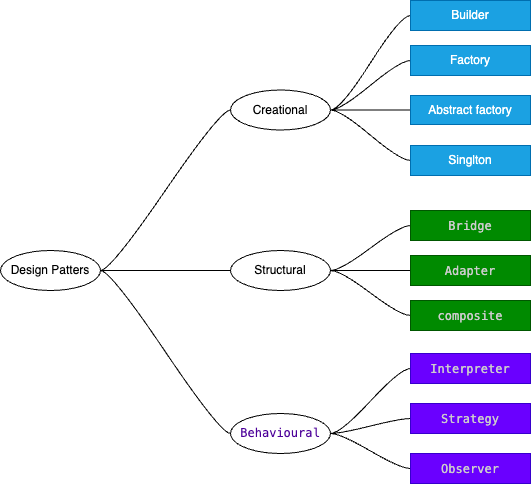

# Design Pattern




Defination : 

Types:

- Creational : creating of objects and clases
- Structural : how to structure the these objects and classes ex. Bridge, Adapter, composite
- Behavioural : how these classes and objects will communicate with each other. ex. Interpreter, Strategy, Observer


__Factory:__
Library should be responsible to decide which obj type to create based on input
Client should just call lib factory and pass the type without worry about actual implementation of creation of object.
ex. 
```java

abstract class Vechile{
    public abstract void createvechile();
}
class car extends Vechile{
    public void createvechile(){
        print("createvechile: Car")
    }
}
class bike extends Vechile{
    public void createvechile(){
        print("createvechile: bike")
    }
}


// client 

class main(){

    //inputtype : car or bike
    String type ;
    Vechile vechile = null;
    if(type =="car"){
        vechile = new Car()
    }
    if(type =='bike'){
        vechile = new Bike()
    }
}
```

better way 

```java
abstract class Vechile{
    public abstract void createvechile();
}
class car extends Vechile{
    public void createvechile(){
        print("createvechile: Car")
    }
}
class bike extends Vechile{
    public void createvechile(){
        print("createvechile: bike")
    }
}
class VechileFactory{
    public static Vechile getVechile(String type){
    Vechile vechile = null;
    if(type =="car"){
        vechile = new Car()
    }
    if(type =='bike'){
        vechile = new Bike()
    }
    }
    return vechile;
}


// client 

class main(){

    //inputtype : car or bike
    String type ;
    Vechile vechile = VechileFactory.getVechile(type); // client doesn't know about implementation and client doesn't need to change the code in future if bus and tempo is introduced.we need to make changes in Lib only.
    vechile.createVechile();

}

```

__Singlton:__

- single object should be created for the class.
- constructor should be **private**.
- mainly used with db connections, loggers
- It should be **thread safe**
- put double check for null instance one before lock and one after lock because locking is expensive.
- Make copy constructor as private
- Make equalto overloading as private
- In c++ , you have to make equaltodelete also as private


__Builder:__

we use when object is very complex and having lot of configurations to build .
ex. to build house , we need interior , pipline, gas,ac


in below example we are creating desktop


- Product = Desktop or Vehicle
- Builder = DesktopBuilder or VehicleBuilder(abstract interface for creating parts of a product object)
- ConcreateBuilder = DellDesktop and HpDesktop or (MotorcyclineBuilder, CarBuilder , ScooterBuilder)
    - constructs and assembles parts of the product by implementing the Builder interface
    - defines and keeps track of the representation it creates
    - provides an interface for retrieving the product

- Director = Is responsible to generate the product ie. civil enginer while constructor of house who guides everyone what to do and what steps they have to follow.
    - Construct an object using the Builder interface

```java

class Desktop{
    var monitor:String = "";
    var keyboard:String = "";
    var mouse:String = "";

    fun showspecs(){
        println("Monitor: $monitor")
        println("Keyboard: $keyboard")
        println("Mouse: $mouse")
    }
}

abstract class DesktopBuilder(val desktop: Desktop = Desktop()) {
   abstract fun buildMonitor ():DesktopBuilder
    abstract fun buildKeyboard ():DesktopBuilder
    abstract fun buildMouse ():DesktopBuilder
    fun getDesktopFromBuilder(): Desktop{
        return desktop
    }
}

class DellDesktopBuilder: DesktopBuilder(){
    override fun buildMonitor(): DellDesktopBuilder {
        desktop.monitor = "Dell Monitor"
        return this
    }

    override fun buildKeyboard() :DellDesktopBuilder{
        desktop.keyboard = "Dell Keyboard"
        return this
    }

    override fun buildMouse():DellDesktopBuilder {
        desktop.mouse = "Dell Mouse"
        return this
    }

}

class HpDesktopBuilder: DesktopBuilder(){
    override fun buildMonitor() :HpDesktopBuilder{
        desktop.monitor = "Hp Monitor"
        return this
    }

    override fun buildKeyboard() :HpDesktopBuilder{
        desktop.keyboard = "Hp Keyboard"
        return this
    }

    override fun buildMouse():HpDesktopBuilder {
        desktop.mouse = "Hp Mouse"
        return this
    }

}

class Director(_builder: DesktopBuilder){
    var builder : DesktopBuilder = _builder

    fun BuildDesktop(): Desktop{
        builder.buildMonitor()
        builder.buildKeyboard()
        builder.buildMouse()
        return  builder.getDesktopFromBuilder()
    }
    
    fun buildDesktop2(): Desktop{
       return builder.buildMonitor().
       buildKeyboard().
       getDesktopFromBuilder()
    }

}

fun main(){

    val dellDesktopBuilder = DellDesktopBuilder()
    val director = Director(dellDesktopBuilder)
    val desktop = director.BuildDesktop()
    desktop.showspecs()

    val hpDesktopBuilder = HpDesktopBuilder()
    val directorDiff = Director(hpDesktopBuilder)
    directorDiff.buildDesktop2().showspecs()
}

main()

```


__OBSERVER:__


