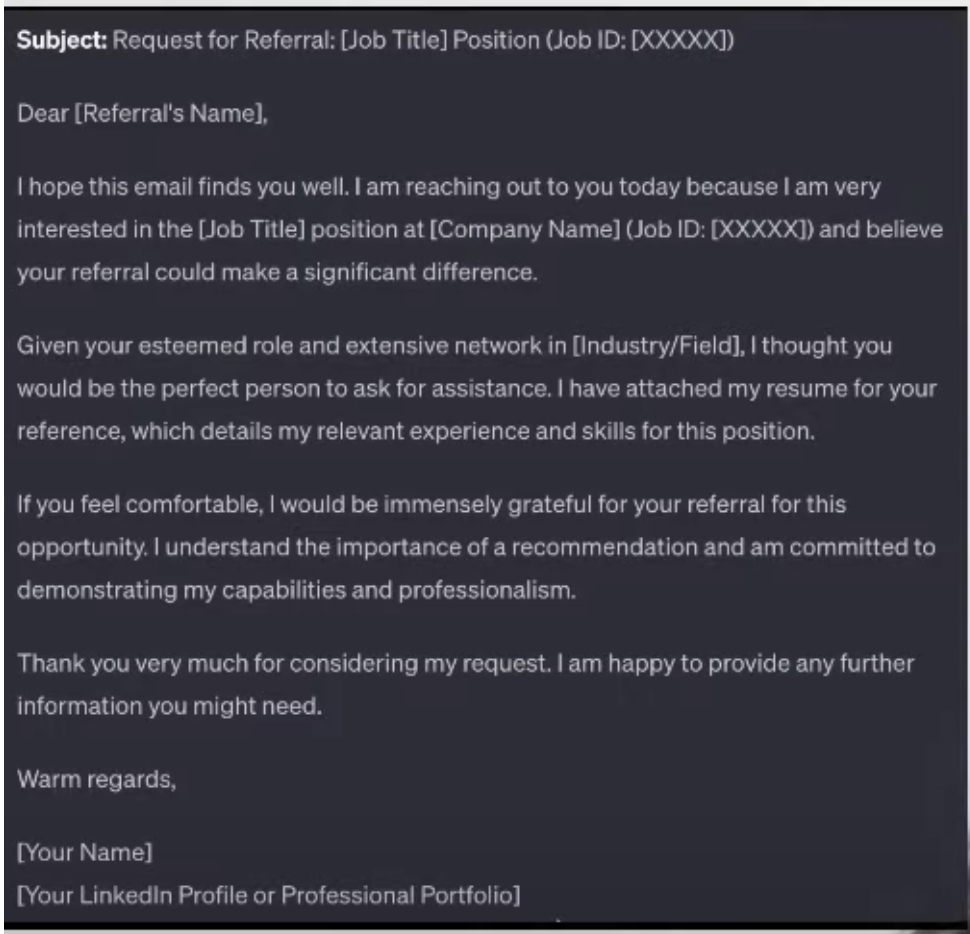

## Send Cold EMAILS : Format : 

## Send referal on linkedin: Format: 

## Apply atleast 30 jobs per day

## On naukri.com update the resume everyday from 9-10 am 

- upload same resume
- heading line section , add space and delete space and save. atleast do it for 30 days

## Recuriters put filter on CTC and immediate joiner
so put ctc 0 and time to join within 15 days

## put profile heading 

## Approch
- find company in naukri and search reference people on linkedin for referal.