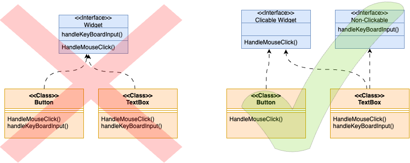
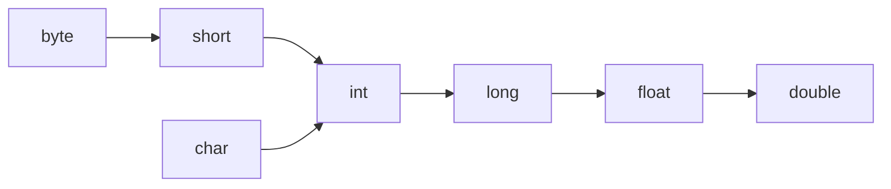

# OOPS
## SOLID Principal
SOLID is an acronym for the first five object-oriented design (OOD) principles by Robert C. Martin (also known as Uncle Bob).

These principles establish practices for developing software with considerations for maintaining and extending it as the project grows. Adopting these practices can also help avoid code smells, refactor code, and develop Agile or Adaptive software.

SOLID stands for:

- S - `Single-responsibility Principle` (A class should have one and only one reason to change, meaning that a class should have only one job.)
- O - `Open-closed Principle`(Objects or entities should be open for extension but closed for modification.)
- L - `Liskov Substitution Principle`(subclasses should be substitutable for their base classes. )
- I - `Interface Segregation Principle` (many client-specific interfaces are better than one general-purpose interface. Clients should not be forced to implement a function they do not need. )
- D - `Dependency Inversion Principle` (our classes should depend upon interfaces or abstract classes instead of concrete classes and functions. )


`SRP` : Gather together the things that change for the same reasons. Separate things that change for different reasons. We do not mix SQL queries with communications protocols.We keep code that is changed for different reasons separate so that changes to one part to not break other parts.

`OCP` : A Module should be open for extension but closed for modification.
example : you have written code for display type TV and mobile but now there is new requirement for Tablet. you can do it via putting if else statements but now your code is not open for extention without modifiying previous code. if you have follwed then you would have interface and seprate classes for display on TV, Mobile and it is easy to extend support for tablets.

`LSP` : A program that uses an interface must not be confused by an implementation of that interface.
example : every square is type of rectangle (if lenght == breath then its square otherwise its rectangle)
but if there is funtion where rectangle is passed and in that rectange function you are setting h and w .
now can you pass square object in this function? NO
and you cannot pass rectange where square object is passed

that means you cannot pass derive class object wherever you are passing base class object.

to solve this we can create a another Shape and we have to derive rectangle and square from shape class.

```kotlin

class Rec{
    Rectangel(int h , int w){
        widht = w
        height = h
    }
}
class square (int h){
    width = h 
    height = h
}

fun create(Rec rec){

}

// this above function we cannot pass square object

interface Shape {

}

class Rectangle : Shape {}
class Square : Shape{}

fun create (Shape){}

here we can pass both

```

`ISP` : Keep interfaces small so that users don’t end up depending on things they don’t need.

example : 
we have widget in which we have inputtext and mouse click so we created 2 functions `handleMouseClick()` and `handleKeyboardInput()`
now Button class and TextBox Class implements the Widget Interface.
but now handkeKyeboardInput doesn't make any sense for button class. and button class forced to implement the method

To solve this we have to create 2 interface 1) CickableWidge 2)Keyboard input widget

Button should implment clickable widget and textBox class should implment both the widgets.



`DIP` : Depend in the direction of abstraction. High level modules should not depend upon low level details.


more you can read : https://blog.cleancoder.com/uncle-bob/2020/10/18/Solid-Relevance.html

or https://www.youtube.com/watch?v=phW8rVlto-U&list=PLliXPok7ZonkudBBQ6aH661wr6keVg2CU&ab_channel=KeertiPurswani

or 
https://www.freecodecamp.org/news/solid-principles-explained-in-plain-english/


## OOP (Object-Oriented Programming) 
OOP is a programming paradigm based on the concept of objects, which are instances of classes. The core concepts of OOP are:

1. Encapsulation: Hiding the internal state of an object and controlling access through methods (getters/setters).
2. Abstraction: Hiding the complexity of implementation and exposing only necessary details.
3. Inheritance: Creating new classes from existing ones, inheriting properties and behaviors.
4. Polymorphism: Allowing objects of different classes to be treated as objects of a common superclass, enabling different behaviors (method overriding or overloading).
5. Classes and Objects: A class is a blueprint for creating objects, and an object is an instance of a class.

OOP promotes modularity, reusability, and maintainability, making it easier to structure complex programs.


## Abstraction
It is about hiding complex details or implementation and providing a simplified interface or representation. 

Example

1. layman know how to use ATM card. but don't know where validation is happening and how its happening.

2. You can press buttons to change the channel, adjust the volume, or power it on/off, but you don’t need to understand how the television’s circuit board or the signal processing works.


In OOP, abstraction allows you to hide the details of an object's implementation by creating abstract classes or interfaces.

<ins>Benefits of Abstraction:</ins>

- Simplifies Code: By focusing on high-level operations and hiding unnecessary details, your code is simpler and more understandable.
- Reduces Redundancy: You don’t have to keep repeating implementation details; they are abstracted away.
- Encapsulates Changes: Changes to the internal workings of a class or function don't affect how it is used externally.
- Improves Maintenance: If you need to change how an operation works, you only need to change the implementation without affecting the rest of the system.

or 

- Security
- Enhacement
- Maintainablity
- Modularity


## Encapusaltion 

The process of grouping data members and corresponding methods into a single unit. you can relate it to casules that we use for medicine. the main medicine is bundled in single pouch that we call capsule.
if any component follows data hiding and abstraction that component called encapuslated component.

`Datahiding + abstraction` 

Key Difference:

- Encapsulation is about protecting and controlling access to an object's data.
- Abstraction is about hiding the complexity of the internal workings of an object.

```java

class Acount {

    private double balance; // by making variable private we are hiding data

    public doube getbalance(){ // balance is not directly acceable but its accessable by getter or setting methods after validation
        // validation
        return balance;
    }
    public void addAmount(double amount){
        //validation
        this.balance = this.balance+amount;

    }
}
```

Is this example is encapsulation?

these getter and setting method will not directly accessable to user. User will have GUI which will have 2 buttons

1. balance enquiery 
2. deposit 

__HIDING DATA BEHIND MEHTODS IS CONCEPT OF ENCAPSULATION__

Advantages are same as of hiding data+ abstraction

<ins>Disadvantages of Encapuslation:</ins>
- Increases number of line of code
- slows down the execution (example : to transfer 10k to friend , we have to give username , password , otp)

### Tightly Encapsulated class

if all variables are private then its TEC.it doesn't matter whether getter setter method is there or not.


## Overloading and Overriding

> what is method signature?

In method `public void method(int i , float f)`  method signature is `method(int,float)`. means name+ parameter type
In java return type is not comes into signature but in c++ return type also comes into signature.

Compiler uses method signature for resolving method calls


#### OverLoading

when both methods have same name but different argument type

In overloading , method resolution is taken care by compiler based on reference type not run time object that's its also called as compile time polymorphism or static polymorphism or early binding

example 
```java
public void m1(int)
public void m1(float)
```

overloading is not avaible in C langaugage. C lang is not object oriented. you have to create different method in C lang

Overloading provide more flexibility to programmer.in C there is function abs(int),fabs(float),labs(long) but in java you can define with same name

C
```c
void abs(int);
void fabs(float);
void labs(long);
```
Java
```java
public void abs(int);
public void abs(float);
public void abs(long);
```
Compiler can promote varaible to next type. here is flow of that.




example 
```java
class Test{

}

class Animal{ }
class Monkey extends Animal{}

public static void main(args ...){
    Test test = new Test();
// Example 1
    //public void m1(int i ){ print("integer");}
    //public void m1(flow f){print("float");}
    test.m1(10); // print integer
    test.m1(10.5f); // print float
    test.m1('a'); // print integer due to promotion . compiler will not give error imeediatly.
    test.m1(10.5); // this is long. there is no promotion for long so compiler will give error here.

/**    Example 2
       public void m2(Object o ){print("object");}
       public void m2(String str){print("String");}
**/
    test.m2(new Object()); // print  object
    test.m2("Vishal"); // print String
    test.m2(null); // print  String, as chil always get priroty

// Example 3
//    public void m3(String str ){print("String");}
//    public void m3(StringBuffer buffer){print("StringBuffer");}
    test.m3("Vishal"); // String
    test.m3(new StringBuffer("vishal"));// StringBuffer
    test.m3(null) //  Compile time error : reference to m3 ambiguous.
    //- In String and StringBuffer , both are child of Object class so there is no common thing. and null is related to both so compiler is confused which method it should call. so it will give compile time error.

// Example 4
//    public void m4(int i ){print("Integer only");}
//    public void m4(int... intarray){print("int array");}
    test.m4();// int arrary
    test.m4(3,4); // int arrary
    test.m4(3); // integer only, because arg concept later so general method wins because its old guy in industry.

// Example 5
//    public void m5(int i, float f ){print("Int-float");}
//    public void m5(float f, int i){print("float-int");}
    test.m5(11,22.5.f); // int-float
    test.m5(22.5.f,11); // float-int
    test.m5(11,11); // compile time error: ambiguous, as both can be promoted , compiler is confused which to choose
    test.m5(22.5f,22.5.f); // no method found error, because int can be promoted to float but float cannot. 

// Example 6 
//    public void m6(Animal a ){print("Animal");}
//    public void m6(Monkey m ){print("Monkey");}
    Animal a = new Animal();
    Monkey m = new Monkey();
    Animal c = new Monkey();
    test.m6(a); // Animal
    test.m6(m) // Monkey
    test.m6(c) //  Animal ,because method resolution taken care by compiler based on reference type not object type.

}
```

- if after promotions there is no arguments found then compiler will give error.
In overloading, exact match will get high priorty
- when there is arugments check for parent and child, then compiler first check with child class then it will go to parent class.


### Overriding

Method resolution always taken care by JVM based on run time object not  by reference that's why called Runtime polymorhism or Dynamic Polymorphsim or late binding.


 Example 

 ```java

class P {
    public void property(){print("GOLD,land")}
    public void marry(){print("sapna")}
}

class Child{
    public void marry(){print("katrina")}
}

class Test {
    fun my(P : p){
        print("Parent")
    }
    fun my(Child : p){
        print("Child")
    }
    
}
void main(){

    P p = new P();
    p.marry(); // sapna

    child c  = new Child();
    c.marry(); // katrina

    P cp = new Child();
    cp.marry(); //katrina, because its taken care by jvm on runtime (Child function)
    
    // but if you pass this object
    Test t = new Test()
    t.my(cp) // It will print Parent

}

 ```

__Covarient type__ : In parent class , method is returing object type then child can return String, String buffer, or any type which is extended by Object.then this type is called covarient type.

ex. Object -> String, Stringbuffer , etc

ex. Number -> Integer,float,double,short,byte,long

```java

class P{
    public Object m1(){}
    public Number m2(){}
    public String m3(){}
    public double m4(){}
}

class C {
    public String m1(){} // allowed
    public int m2(){} // allowed
    public Object m3(){} // not allowed, compiler will give error : object type is not compatable with String
    public int m4(){} // compiler error: int not compatiable with dobule, primitive type not allowed

}

```

Rules : 

1. Method signature should be same
2. Return type no need to be same as parent type but it should be covarient type.
3. covarient return is applicable for objects not primitive data types
4. if parent return type is primitive, then child method return type should be same as parent


