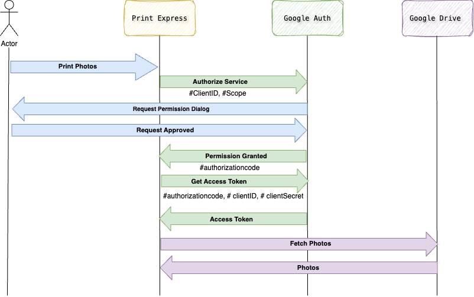

### SAAS - software as a service
It is a cloud-based software delivery model where customers pay for software products on a subscription basis.

### [IAM](https://auth0.com/docs/get-started/identity-fundamentals/identity-and-access-management) - Identity Access Management

Identity and access management provides control over user validation and resource access. Commonly known as IAM, this technology ensures that the right people access the right digital resources at the right time and for the right reasons.

In IAM, a user account is a digital identity. User accounts can also represent non-humans, such as software, Internet of Things devices, or robotics.

IAM is a discipline and a type of framework for solving the challenge of secure access to digital resources.

Authentication is the verification of a digital identity. Someone (or something) authenticates to prove that they’re the user they claim to be. 

Authorization is the process of determining what resources a user can access. 

authentication proves a user’s identity, while authorization grants or denies the user’s access to certain resources. 

### [Identity Providers](https://auth0.com/docs/get-started/identity-fundamentals/identity-and-access-management#identity-providers)
Its very difficult to create account,login to multiple applications and filling forms.
its very hard to remember all password also

here comes IP which will create your information and give rights to other application that you are valid idenity.

Identity providers don’t share your authentication credentials with the apps that rely on them. Slate, for example, doesn’t ever see your Google password. Google only lets Slate know that you’ve proven your identity. 

 Other identity providers include social media (such as Facebook or LinkedIn), enterprise (such as Microsoft Active Directory), and legal identity providers (such as Swedish BankID).

### Authentication Factors
Authentication factors are methods for proving a user’s identity. IAM systems require one or many authentication factors to verify identity.They commonly fall into these basic types:

| Factor type | Examples |
| -------- | -------- |
| Knowledge (something you know)   | Pin, password  |
| Possession (something you have)  | Mobile phone, encryption key device   |
| Inherence (something you are)    | Fingerprint, facial recognition, iris scan  |

Authentication and authorization standards are open specifications and protocols

Below IAM industry standards are considered the most secure, reliable, and practical to implement:

- OAuth 2.0
- OpenID connect (OIDC)
- json web tokens (JWTs)
- SAML (Security Assertion Markup langaguge)
- WS-FED

### [Auth0](https://auth0.com/docs/get-started/identity-fundamentals/introduction-to-auth0)

### OAuth 2.0
OAuth 2.0 is an authorization framework that allows applications to access resources on behalf of a user without sharing the user's credentials. It's widely used for secure data sharing between different applications.

#### Roles in OAuth 2.0
- Resource owner: The user who owns the data (e.g., photos on Google Drive).
- Client : The application requesting access to the user's data (e.g., a printing service).
- Authorization Server : Issues access tokens after user consent (e.g., Google).
- Resource Server : Hosts the protected resources (e.g., Google Drive).

#### Example
Let's say you want to print photos from your Google Drive using a third-party printing service called Print Express.

Step 1 : Authorization Request
 - Print Express : (Client) requests authorization from you (Resource Owner) to access your photos on Google Drive.
 - You are redirected to Google's authorization page.

Step 2  : User Consent
- You grant Print Express permission to access your photos.
- Google (Authorization Server) redirects you back to Print Express with an authorization code.

Step 3 : Token Exchange
- Print Express exchanges the authorization code for an access token with Google.
- This access token is used to access your photos on Google Drive.

Step 4 : Resource Access
- Print express uses the access token to retrieve your photos from Google Drive (Resource Server).
- You don't need to share your Google credentials with Print Express.

#### Key benefits

- Security : No sharing of credentials.
- Control : Users can revoke access at any time.
- Flexiblity : Supports various client types (web, mobile, desktop).

#### Common grant types
- Authorization Code Grant: Used for web apps.
- Imlicit Grnant : Used for clients that cannot store or handle client secrets securely (e.g., JavaScript apps).
- Client Credentials Grant: Used for server-to-server interactions.

#### Other Things : 

- TCP RELAY