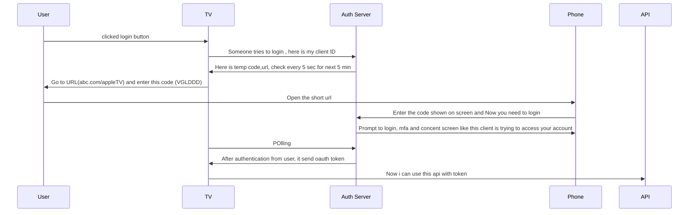
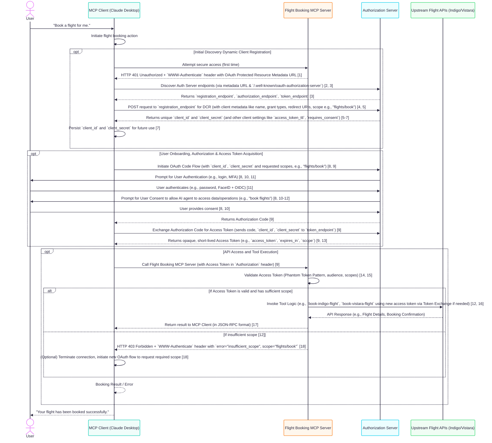

### SAAS - software as a service
It is a cloud-based software delivery model where customers pay for software products on a subscription basis.


### [IAM](https://auth0.com/docs/get-started/identity-fundamentals/identity-and-access-management) - Identity Access Management

Identity and access management provides control over user validation and resource access. Commonly known as IAM, this technology ensures that the right people access the right digital resources at the right time and for the right reasons.

In IAM, a user account is a digital identity. User accounts can also represent non-humans, such as software, Internet of Things devices, or robotics.

IAM is a discipline and a type of framework for solving the challenge of secure access to digital resources.

Authentication is the verification of a digital identity. Someone (or something) authenticates to prove that they’re the user they claim to be. 

Authorization is the process of determining what resources a user can access. 

authentication proves a user’s identity, while authorization grants or denies the user’s access to certain resources. 

### [Identity Providers](https://auth0.com/docs/get-started/identity-fundamentals/identity-and-access-management#identity-providers)
Its very difficult to create account,login to multiple applications and filling forms.
its very hard to remember all password also

here comes IP which will create your information and give rights to other application that you are valid idenity.

Identity providers don’t share your authentication credentials with the apps that rely on them. Slate, for example, doesn’t ever see your Google password. Google only lets Slate know that you’ve proven your identity. 

 Other identity providers include social media (such as Facebook or LinkedIn), enterprise (such as Microsoft Active Directory), and legal identity providers (such as Swedish BankID).


### Authentication Factors
Authentication factors are methods for proving a user’s identity. IAM systems require one or many authentication factors to verify identity.They commonly fall into these basic types:

| Factor type | Examples |
| -------- | -------- |
| Knowledge (something you know)   | Pin, password  |
| Possession (something you have)  | Mobile phone, encryption key device   |
| Inherence (something you are)    | Fingerprint, facial recognition, iris scan  |


Authentication and authorization standards are open specifications and protocols

Below IAM industry standards are considered the most secure, reliable, and practical to implement:

- OAuth 2.0
- OpenID connect (OIDC)
- json web tokens (JWTs)
- SAML (Security Assertion Markup langaguge)
- WS-FED


### [Auth0](https://auth0.com/docs/get-started/identity-fundamentals/introduction-to-auth0)

### OAuth 2.0 (RFC 6749)
OAuth 2.0 is an authorization framework that allows applications to access resources on behalf of a user without sharing the user's credentials. It's widely used for secure data sharing between different applications.

#### Roles in OAuth 2.0
- Resource owner: The user who owns the data (e.g., photos on Google Drive or user).
- Client : The application requesting access to the user's data (e.g., a printing service or the application).
- Authorization Server : Issues access tokens after user consent (e.g., Google).
- Resource Server : Hosts the protected resources (e.g., Google Drive or the api).
- User Agent (The Device)

#### Example
Let's say you want to print photos from your Google Drive using a third-party printing service called Print Express.

Step 1 : Authorization Request
 - Print Express : (Client) requests authorization from you (Resource Owner) to access your photos on Google Drive.
 - You are redirected to Google's authorization page.

Step 2  : User Consent
- You grant Print Express permission to access your photos.
- Google (Authorization Server) redirects you back to Print Express with an authorization code.

Step 3 : Token Exchange
- Print Express exchanges the authorization code for an access token with Google.
- This access token is used to access your photos on Google Drive.

Step 4 : Resource Access
- Print express uses the access token to retrieve your photos from Google Drive (Resource Server).
- You don't need to share your Google credentials with Print Express.


Don't provide client secreat in mobile / web apps as they are public facing apps 

For frontend web apps flow is like 
- user wants to use the app
- App generates random number (PKCE secreat or `code verifier`) and hash it(`code challenge`). and its only for that flow or request only.(PKCE flow) and this code is called pkce code verifier
- Now it will give this `hash` to browser to open url with app `client ID`,`redirecturl` and `scope`. (First message in front channel to auth server)
- Now user login in auth server
- server return with one time `authorization code`(like a coupon) on redirect uri with short period of time (1 min)
- Now app can do backchaneel request with this coupon code to get access token.user cannot see this request . mostly it happen from app server to oauth server.
- `app server` sends `coupon` , `client id` , `client secreat` and `plain text pkce secreate` to oauth server
- oauth server checks `client id` , `client secreat`, and `calculate hash of pkce secreate` and verfiy that its same person is claiming from where the request is originated.
- all good , then token is given in response

#### Key benefits

- Security : No sharing of credentials.
- Control : Users can revoke access at any time.
- Flexiblity : Supports various client types (web, mobile, desktop).

#### Common grant types
- Authorization Code Grant: Used for web apps.
- Implict Grant : Used for clients that cannot store or handle client secrets securely (e.g., JavaScript apps).
- Client Credentials Grant: Used for server-to-server interactions.


Oauth2 defines 2 types of clients
- Confidential : Has credentials in form client secreat
- Public clients : No Credentials


PKCE (Proof key for code exchange `RFC 7636`) protects agains authorization code injection attacks.


```python
  """ In WEb
  RANDOM_STRING = "888888888"
  HASH_OF_RANDOM_STRING = "999999"
   https://url.com/auth?
        response_type=code&
        client_id=ddjplDBElhpk6fp23OD3bMnjdFzVxa0Y&
        redirect_uri=http://127.0.0.1:8000/callback&
        scope=openid%20profile%20email&
        state=12345 (random code if pkce is not supported on server)its used for csrf protection, this will get back from auth server
        codeChallenge = HASH_OF_RANDOM_STRING& // hash of random string , this will be stored by auth server
        codeChallengeMethod=S256

    after getting auth code : AUTH_CODE you hit post
    https://url.com/token
       grant_type=authorization_code&
       code=AUTH_CODE&
       redirect_uri=http://127.0.0.1:8000/callback&
       client_id=CLIENT_ID&
       client_secret=CLIENT_SECRET&
       code_verifier=RANDOM_STRING // Now we are adding plain text of random string so that auth server can verify in their end that previous request is same or not.
    
    Response
        {
        token_type:"Bearer"
        access_token:"ACCESS_TOKEN",
        expires_in:3600,
        "scope":"SCOPE",
        refresh_token:"REFRESH_TOKEN"
        }
    
 
    To refresh the token
    POST https://url.com/token
        grant_type=refresh_token&
        refresh_token=REFRESH_TOKEN&
        client_id=CLIENT_ID&
        client_secret=CLIENT_SECRET& 
   """    
```

In mobile apps we don't put client_secreate so there are two ways to redirect back to app
- custom scheme like example:// but there is no claim that only this app can use this , any app can put in there code.
- Deep linking : claiming url patterns, this is more secure as developer has to prove that they own this domain or url


Mobile we can use `SFSafariViewController` on iOS,
And on Android `Chrome Custom Tabs`.


For Mobile apps flow is like 
- user wants to use the app
- App generates random number (PKCE secreat or `code verifier`) and hash it(`code challenge`). and its only for that flow or request only.(PKCE flow) and this code is called pkce code verifier
- Now it will give this `hash` to browser to open url with app `client ID`,`redirecturl` and `scope`. (First message in front channel to auth server)
- Now user login in auth server in opened tab(this browser is from system and cookies are shared between the system . if user already enrolled in main browser which is shared with system then this will also get loggin automatically)
- server return with one time `authorization code`(like a coupon) on redirect uri with short period of time (1 min)
- Now app can request with this coupon code to get access token.user cannot see this request. it happen from app code to oauth server.
- `app` sends `coupon` , `client id` , and `plain text pkce secreate` to oauth server.(as this is mobile so we don't have client secreat)
- oauth server checks `client id`, and `calculate hash for secreate` and verfiy that its same person is claiming from where the request is originated.
- all good , then token is given in response

>NOTE: In mobile we don't send `client_secreate`  for `/token` api.


#### Single page Applications (Javascript)
For javascript apps, there is potential attack for refresh tokens

So we cannot store in localstorage, session storage and cookies directly. 

Some workaround are, 
- use service Worker which will store the token , Now even your app cannot access token, you need to tell server worker to call the api. Their may be chances that attacker script may be able to call service worker api
- CyrptoApi, this is storage but not supported by safari and IE.So it create private keys store the data. This is also not perfect solution as attacker can use that key but its hard to do 


To come out of it, we can use backend server which will save session with  tokens and provide browser that cookie httponly for that movement.


#### IOT or smarthome device


```python
"""
REQ
    Post https://authserver.com/device

        client_id: CLIENT_ID&
        scope=youtube
RESPONSE: 
    {
    device_code: "ajdnaosdasdflasflkjafsd",
    user_code : "VGLL-UPDD"
    verification_uri: "https://example.com/device"
    "expire_in":1800,
    interval : 5
    }


REQ POlling:
    POST https://authserver.com/token
        grant_type=urn:ietf:params:oauth:grant-type:device_code&
        client_id=CLIENT_ID&
        device_code = "Which came from reponse"

RESPONSE: 
    {
        "error":"authorization_pending"
    }
RESPONSE:    5 sec
    {
        "error":"authorization_pending"
    }
RESPONSE: after user done auth on phone   
    {
        "access_token":"vgsdfhjdhjaskasdf",
        "expire_in":1800,
        "refresh_token":"b7ndns9dsidsjjs",

    }

"""

```


### OpenId Connect

its an extention of OAuth. Main goal is to provide information to application.
oauth is used to accessing the apis but openidconnet is application knowing about user.
Openid adds id token into picture.The ID Token is the way that the authorization server communicates information about the user who just logged in to the application. It is the json web tokens.

servers also use that format for access tokens.

Now, in the case of access tokens, access tokens don't have any defined format in the spec. Access tokens can be anything.

ID token or json web token is divided into 3 parts base64 encoded
- headers : talks about token
- payload : contains data
- signature : how you validate that token

```json

{
    "alg": "RS256",
    "typ": "JWT",
    "kid": "JadfsfasdfsdfsdWT" //key that signed the token. some auth servers provide static keys on well known page.Main reason to put here if auth server rotate keys then it will difficult to find the right key so they put keys in jwt for validations.
}
{
    "sub": "USER_ID", // user identitifer, it can be email, unique id 
    "role": "admin",
    "email": "admin@gmail.com",
    "iss": "https://authorize.com/oauth/adsfasdfs", // issuer
    "audience": "CLIENT_ID", // for whom this token is for
    "iat": "1672531199", // issued at time
    "exp": 1672531199, // expired at time
    "amr":[
        "pwd"// tells that how user logged in 
    ],
    "auth_time":"1672531199" // last time user logged in auth server
}
HMACSHA256(
    base64UrlEncode(header) + "." + base64UrlEncode(payload),
    secret
)
```


#### Difference between access token and id token
access token is what the application gets in order to be able to make API requests to an API. So you can think of the application getting the access token from the authorization server and then sending it to an API to use to make API requests. When it does that, it does not need to actually understand what the access token means.In fact, it MUST NOT understand what the access token means.

It's actually a design principle of OAuth that access tokens are opaque to applications.That means that they can't actually see through them, they can't see into them.

the hotel key analogy.When you go get a key card from the hotel reception, you don't actually care what's on it.
All you care about is that when you use access card or key at the door, it works.


ID tokens, on the other hand, are a whole different story.
Now, ID tokens *are* meant to be read by the application.That's more like the application looking at a passport that belongs to a user.The application is meant to look inside the ID token, validate the signature, validate the claims, and then learn about the user.

#### How to get ID token
we need to add `openid` in scope then we will get id token with access token
```json
 {
        "token_type":"Bearer",
        "access_token":"vgsdfhjdhjaskasdf",
        "expire_in":1800,
        "refresh_token":"b7ndns9dsidsjjs",
        "id_token":"asdfsb7ndns9dsidsjjsb7ndns9dsidsjjs.sdfsd.sdfsdf"

    }
```


Another Way

there's a different way you can get an ID token, and that's to use a different flow.If you actually use instead of `response_type=code`, if you use `response_type=id_token`,that's telling the authorization server that you actually don't want an access token at all. And that will give you just an ID token. And in that mode, it returns the ID token in the redirect instead of the authorization code and that looks a lot like the Implicit flow in OAuth, where it returns the token without the intermediate authorization code.

>Implict is not secure as server donesn't know that it is receieveed by frontend or not.
`https://url.com/auth?response_type=id_token&`

When its is coming with normal flow, then we have access token means server validated that and then we don't need to validate the id token but when its coming from redirect uri or implict flow then we need to validate the id token.

OpenID connect scopes
- openid
- profile : name and photo
- email
- phone
- address

There is hybrid mode where you got both
`https://url.com/auth?response_type=code+id_token&`

its not recommended to any other token with these like `token` , `code_token`
so recommendation is to use `https://url.com/auth?response_type=code&scope=openid` and in response you will get both when you hit for token api.

if you use `https://url.com/auth?response_type=code+id_token&` then you need to validate the id_token from `c_hash` which comes from response. its good that you get id token in first api itself but you need to validate also.


#### Validate the ID token
If you get the ID Token over the front channel using the implicit or hybrid flows, then it need to validated.

- Validate the signature : that confirm that inside that is not tempered
    
    Some servers use hard coded keys in documentation , if keys are rotating then they put keys in header of id token `kid`. Now use Json Web token lib to validate the sigature
- Check `iss` issuer key which tells that id token is coming from valid server. we need to check with our openid connnect server's issuer
- check `aud`, which tells the token is generated for this application only.we need to check this with our application client ID
- check `iat` and `exp`, which tells issuer time and expired time. so current time is betwen this time only.
- check `nonce`, check that its the same nonce you set in request.

-----
Access token are of two types
- reference token : random string which can be stored in server db with `token`,`scope`,`expiry`,`userid` or `etc`.
- json token : which stores data  within itself.you don't need to store on server. 

> Note : access token should be opaque means its key card for door . user should not know or don't need to know whats inside that token.

|item|Reference Token | JSON token|
|--|--|--|
|Storage|❌  yes need to store in cloud db|✅ No need as they self contained information|
|Validation|❌ Yes every request from DB|✅ can be validated without network|
|visiblity | ✅ its random string , so no data| ❌ JWT content are visible|
|Revoke|✅ its stored in db so easy to delete |❌  No way to revoke 


For revokation, oauth servers generally stores state on top of jwt token so that state about whether token have been revoked or whether user have been deleted.if you do token introspection then you get right answer but apis need to ask that from server.

OAUTH 2.0 TOKEN Introspection -  `RFC 7662`


JWT token format defined in RFC: 
- SCOPE : oauth2.0  section 3.3 of auth2.0 `RFC 6749`
- TOKEN_TYPE : oauth2.0 sec 5.1 `RFC 6749`
- exp : JWT `RFC 7519`
- iat : JWT `RFC 7519`
- nbf : JWT `RFC 7519`
- aud : JWT `RFC 7519`
- iss : JWT `RFC 7519`
- jti : JWT `RFC 7519`

Acess token should be short time

for admin users access token = 1 hr and refresh token =24 hr so that they will login everyday.

For normal users access token =24 hr and refresh token = lifetime so that they will not get intrupption.
but if user is in checkout flow(items added in cart and buying now) and you want them to login then put scope checkout , and acces token time for 3 hr and refresh token as none.

>If we are following best practices like pkce flow, not using impllict flow then we already know about 2.1

MATERIAL : 

https://www.oauth.com/playground
 OAuth.com
  oauth.net.

  https://example-app.com/client

https://auth0.auth0.com


### DCR Flow (RFC 7591)
https://modelcontextprotocol.io/docs/getting-started/intro
https://modelcontextprotocol.io/specification/2025-06-18
https://curity.io/resources/learn/design-mcp-authorization-apis/#client-registration
https://modelcontextprotocol.io/docs/learn/architecture

https://www.rfc-editor.org/rfc/rfc9728.html

https://curity.io/resources/learn/openid-connect-understanding-dcr/

https://curity.io/resources/learn/dynamic-client-registration-authentication-methods/

https://www.strata.io/maverics-platform/identity-orchestration-for-ai-agents/#consolidate

https://www.strata.io/blog/agentic-identity/just-in-time-provisioning-creates-artificial-agent-identities-on-demand-5b/




## SSO
Single Sign ON 

It is an authentication method where user can login to multiple application from multiple devices from single set of credentials.
It works best on trust relationship setup up between applications (Service providers) and identity providers.

One-click secure access to all resources your employees need. This includes access to resources both on-prem or in the cloud. Let your team focus on work, rather than trying to remember passwords.

Login to portal > Single Sign on creds > get acess to all app ex (social,google directory service, Microsoft AD, LDAP)

### SAML


### Different types of Single Sign On Mechanisms

| Mechanism        | Protocol          | Common Use Case           | Format | Cloud-Friendly |
| ---------------- | ----------------- | ------------------------- | ------ | -------------- |
| SAML             | SAML 2.0          | Enterprise Web Apps       | XML    | ✅              |
| OAuth 2.0 + OIDC | JSON + HTTP       | Web, Mobile, APIs (social login)        | JSON   | ✅✅             |
| Kerberos         | Kerberos          | On-Prem AD Networks       | Binary | ❌              |
| LDAP             | LDAP              | Legacy Systems            | Text   | ❌              |
| CAS              | Custom Protocol   | Academic Environments     | Text   | ☑️ (limited)   |
| Smart Card       | Certificate-Based | High-Security Enterprises | X.509  | ❌              |

### SAML vs Auth2.0

Common Steps:

    User tries to access a protected app.

    App redirects browser to Identity Provider (SSO).

    User logs in at IdP.

    IdP sends a response (SAML Assertion or ID Token) back to the app via the browser.

    App verifies the response and creates a session.


| Aspect               | **SAML 2.0**                      | **OAuth 2.0 + OIDC**                         |
| -------------------- | --------------------------------- | -------------------------------------------- |
| **Purpose**          | Authentication only               | OAuth: Authorization; OIDC: Authentication   |
| **Format**           | XML                               | JSON / JWT                                   |
| **Transport**        | HTTP Redirect / POST (Base64 XML) | HTTPS (JSON, tokens in URL or body)          |
| **Token Type**       | SAML Assertion (XML)              | ID Token (JWT), Access Token (JWT or opaque) |
| **Audience**         | Enterprises, legacy web apps      | Modern web, mobile, APIs                     |
| **SP Role**          | Service Provider                  | Relying Party / Client                       |
| **IdP Role**         | Identity Provider                 | Authorization Server + IdP (in OIDC)         |
| **Extensibility**    | Limited, XML schema bound         | High (JSON-based, supports scopes/claims)    |
| **Common Providers** | Identity, Okta, ADFS, Ping, Azure AD       | Identity, Google, GitHub, Auth0, Firebase, AWS Cognito |

SAML is identity-assertion centric:
“Here’s a digitally signed XML document stating who this user is.”

OIDC (on top of OAuth) is token-centric:
“Here’s a signed JWT ID token that asserts the user’s identity, plus access token for APIs if needed.”

Not all Single sign follow above 5 steps
ex  : 
- Kerberos(Uses tickets, Authentication is handled at OS level not app level)
- LDAP Authentication : 
    - App connects directly to an LDAP server (like Active Directory) to authenticate.
    - SSO works when combined with Kerberos or a reverse proxy.
- Smart Card / Certificate-Based
    - Authentication happens using client-side certificates or physical smart cards.
    - Often plugged into the browser or OS login.


Trust Model of SAML


#### How IdP ensures it’s valid:
1. Signature Validation (Optional but Recommended):
    - The SP signs the AuthnRequest using its private key.
    - The IdP validates the signature using the SP’s public certificate (previously exchanged during metadata setup).
    - This confirms:
        - The request came from a trusted SP.
        - The request was not tampered with.

1. SP Metadata:
    - SP and IdP trust each other based on pre-shared metadata.
    - Metadata contains:
        - SP entity ID
        - SP public key
        - Assertion Consumer Service (ACS) URLs
        - Binding method (POST, Redirect)

    - IdP uses this metadata to:
        - Check if the incoming request is from a known SP.
        - Verify request bindings and endpoints match expectations.

1. Timestamp & Replay Protection:
    - The Authn Request contains timestamps (Issue Instant).
    - IdP can reject requests that are too old or reused.


### Reference 
Auth2.0 :
https://www.youtube.com/watch?v=CPbvxxslDTU&ab_channel=InterSystemsLearningServices

IDP : https://www.youtube.com/watch?v=hDRVq7T2A3M&ab_channel=JumpCloud

PKI : https://www.youtube.com/watch?v=5OqgYSXWYQM&ab_channel=PaulTurner

Single Sign on : https://www.youtube.com/watch?v=-hWaEy7_XQU&ab_channel=AutomatedTesting


AWS LAMBDA : https://youtu.be/qYM5UwhIkPI?si=OfWXhqUStBDQBZWd

OIDC : https://openidconnect.net/


#### Other Things : 

- TCP RELAY