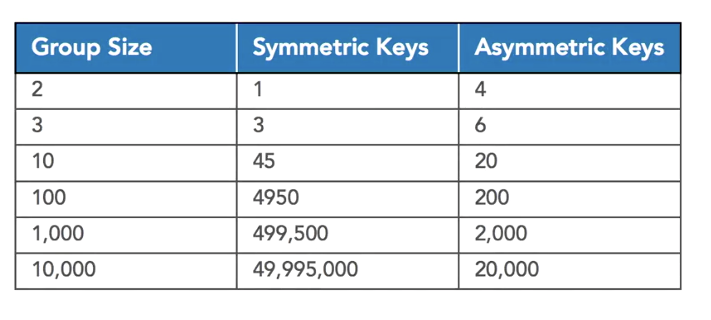

# Cryptography

Cryptography is the use of mathematical algorithms to transform information into a form that is not readable by unauthorized individuals.Cryptography does however,provide authorized individuals with the ability to transform that encrypted information back into readable form.

Encryption : Converts information from plain text form into encrypted ciphertext

Decryption : Converts ciphertext messages back into their plaintext form

algorithm are simply a set of mathematical instructions that one follows to achieve a desired result.Think of an algorithm as a mathematical recipe. Algorithms are very similar to computer code and, in fact, computer code is often designed to implement mathematical algorithms.

```
Encryption Algorithms
Input : P , the plaintext message
Input : K , the encryption key

Perform encryption setups using P and K

Output : C , the encrypted ciphertext


- Input : C , the ciphertext
- Input : K , the decryption key
- Perform decryption setups using c and K
- Output : P , plaintext message

```

### Symetry and Asymetry alogrithms

Two of the major categories of encryption algorithms
 
are symmetric and asymmetric algorithms.
You're probably already familiar
 
with the concept of symmetry, meaning that two things
 
are the same.
 
Symmetric shapes have two sides,
 
that when divided along an axis, are identical.
In cryptography, symmetry relates to keys
 
rather than shapes.
 

In cryptography, symmetry relates to keys
 
rather than shapes.
 
We have two categories of encryption algorithms.
 
In symmetric encryption algorithms,
 
also known as shared secret encryption algorithms,
 
the encryption and decryption operations use the same key.
 
If one user encrypts a message using the secret key apple,
 
the second user would then decrypt the message
 
using that same key, apple.
 
It's a shared secret.

Asymmetric encryption algorithms, on the other hand,
 
use different keys for encryption and decryption.
 
They are also known as public key encryption algorithms
 
and they use the concept of a key pair,


### symmetric key

First, let's dive more into symmetric encryption.
You can think of a shared secret key
as the password to a message.
Let's say that Alice and Bob want to communicate
with each other.
If they both know the same shared secret,
they can use it to exchange encrypted messages
with each other.
This works great when we have two people involved.
They can simply agree on an encryption key
and then use it to communicate with each other.
If we have three people involved, now we need
to change things a little bit.
Alice and Bob can still use their shared secret key
to communicate with each other privately,
but now Charlie joins the picture
 and wants to be able to communicate with Alice or Bob.
 Each person in the group wants the ability
 to communicate privately with any other member of the group.
 Alice already has a way to communicate privately
 with Bob, but then we need to add a second key
 that allows her to communicate privately with Charlie.
 And we still have a missing link here.
 Bob and Charlie don't have a way to communicate privately.
 We have to add a third key that allows those two
 to communicate with each other.
 So for these three people to communicate privately,
 using symmetric cryptography,
 we need three keys.
 As groups get larger, we need more and more keys
 to facilitate this communication.
 There's a formula that computes
 the number of keys required for symmetric cryptography.
 Where n is the number of people who wish to communicate,
 we multiply n by n minus one
 and then divide the result by two.
 As you can see, when we grow to larger groups,
 symmetric cryptography starts to require
 an unmanageable number of keys.
 For example, if we have an organization
 with 10,000 employees, we'd need
 almost 50 million encryption keys.
 If a new person joins the organization,
 we'd need to generate 10,000 new keys
 for that one person to be able to communicate
 with the other employees in the organization.
 And then we'd need to distribute those 10,000 keys
 to every other employee in the organization.
 Asymmetric cryptography solves this problem for us
 by using the concept of keypairs.
 Each user gets two keys, a public key
 that can be freely distributed to anyone the user
 might wish to communicate with,
 and a private key that they keep secret
 and don't disclose to anyone else.
 In asymmetric cryptography, anything that is encrypted
 with one key from the pair, can be decrypted
 with the other key from that pair.
 For normal communications, the sender of the message
 would encrypt it with the recipient's public key,
 which is publicly known.
 The recipient would then use his or her private key
 to decrypt the message.
 
> Remember that in asymmetric cryptography,
 the keys must be from the same pair.
 If Bob encrypts a message for Alice,
 he uses Alice's public key,
 and then Alice uses her own private key
 to decrypt the message, because Alice's public
 and private key come from the same pair.
 People get this confused on the exam all the time.
 So make sure you review it carefully
 before you take the test.


Asymmetric cryptography is slower
 than symmetric cryptography, but is solves our problem
 of creating keys for large organizations.
 We only need two keys for each user.
 As you can see in this table,
 it results in much more manageable key counts for large organizations

 

## 4 Goals

#### preserve confidentiality

Confidentiality ensures that
 unauthorized individuals are not able to gain access
 to sensitive information.
 
If Alice and Bob are communicating with each other
 using encryption, they want to ensure that
 their communication remains private,
 and even a third-party, Mal, intercepts their communication,
 she is unable to read the contents.
 

When we use cryptography to protect
 the confidentiality of information,
 we consider three different states of data
 where it might be exposed to prying eyes.
 Data at rest is data stored on a hard drive or other storage device.
 We can use encryption to protect stored data
 so that it remains protected
 even if the device is lost or stolen.
 
Data in transit, or data in motion,
 is data being sent over a network between two systems.
 We use encryption to protect data in motion
 so that it remains protected,
 even if someone eavesdrops on the network communication.
 
And finally, data in use is in memory
 where it is actively being used by an application.
 We can use encryption to protect this data
 from access by other processes or individuals.


#### integrity


Integrity protects messages and other content
 
against unauthorized modification.
 

If Alice and Bob are communicating with each other,
 
they want to make sure that Mal
 
is not able to tamper with the message.
 
Bob wants to know that the message he received
 
claiming to be from Alice,
 
is actually the message that Alice sent.

#### authentication
 
The third goal of cryptography is authentication.
 
Many systems that verify the identity of users
 
rely upon the use of encryption.
 
We'll talk more about the use of encryption
 
to provide authentication
 
when we discuss identity and access management.

#### nonrepudiation
 
The final goal of cryptography is nonrepudiation.
 
Nonrepudiation means that the recipient of a message
 
can prove to an independent third-party
 
that the message actually came from the alleged sender.
 
For example, if Alice sends a message to Bob
 
using an encryption algorithm
 
that supports nonrepudiation,
 
Bob could then show the message to Charlie
 
and prove that the message actually came from Alice
 
and that he didn't simply create it himself.
 
The technology that we use to achieve nonrepudiation
 
is called digital signatures.
 
We'll discuss digital signatures later in this course.


Nonrepudiation is only possible
 
with asymmetric encryption algorithms.
 
Remember, in symmetric cryptography,
 
the sender and receiver both know and use the same key.


 
In this approach, it would be easy for Bob
 
to forge a message from Alice
 
because Bob knows the same secret key that Alice does.
 
If Bob receives a message encrypted with that key,
 
he knows that it came from Alice
 
because she is the only other person with a key.
 
Bob can't however prove to Charlie
 
that the message came from Alice
 
because Bob could just as easily
 
have created it himself.

>Symmetric encryption algorithm
Block Cipher operating on 64-bit blocks
Effective key length of 112 bits
Considered secure

3DES :
AES
BLOWfish
twofish


RC4:RC4 : widly used for Networks but not secure


CIPHER MODES : 
    - ECB
    - CBC
    - CTR

Encrypting the same block with same key in ECB mode reuslts in identical cipher text blocks 

# Steganography


### RSA keys
    - Sender encypts a message using the recipient's public key.
Recipient decrpts a message using the recipient's private key.

Key Facts about RSA
    - Asymmetric encyption algo
    - Variable length key between 1024 and 4096 bits
Considered secure

PGP: 


# Android TOP 10
## SENSITIVE INFORMATION DISCLOUSER ([OWSAP Mobile Data storage](https://owasp.org/www-project-mobile-top-10/2016-risks/m2-insecure-data-storage))

### Backup 
If backing up is not required, disable the functionality in the AndroidManifest.xml file:
```xml
<application
    android:allowBackup="false">
    ...
</application>
```
if you want to backup some data you can do that also 
```xml
<?xml version="1.0" encoding="utf-8"?>
<full-backup-content>
    <include domain="sharedpref" path="."/>
    <exclude domain="sharedpref" path="user.xml"/>
</full-backup-content>
```

### screenshotting

```java
protected void onCreate(Bundle savedInstanceState) {
    super.onCreate(savedInstanceState);

    getWindow().setFlags(WindowManager.LayoutParams.FLAG_SECURE, WindowManager.LayoutParams.FLAG_SECURE);

    setContentView(R.layout.activity_sensitive_data_holder);

    // ...
}
```

### hardcoded sensitive material

 In particular, tools like Apktool are also able to decompile the Dalvik bytecode contained in classes.dex, creating a .smali file for each original source code file.

Think of .smali files as the mnemonic representation of the Dalvik bytecode; hence, they contain an equivalent source code and all the constants, including possibly sensitive data left there by careless developers.

### Components like permissions
When a more rigid coupling is required, Android allows friend applications to have a closer relationship, enabling them to grant one other special privileges. One possible way to achieve this friend status is to sign all apps with the same key; this is enough proof for Android to accept that all such applications have emerged from the same development team. Hence, they trust each other.

https://commonsware.com/blog/2014/02/12/vulnerabilities-custom-permissions.html

## BROKEN AUTHENTICATION ([OWASP MOBILE](https://owasp.org/www-project-mobile-top-10/2016-risks/m4-insecure-authentication))
an attacker being able to bypass the authentication mechanism of the vulnerable application due to poor configuration, logic errors, or bugs in the software.

The following controls can strengthen your authentication when appropriately implemented:

- Implement Multi-Factor Authentication (MFA). MFA can significantly reduce the risk of unauthorized access by requiring users to provide multiple forms of identification (something they know, something they have, or something they are). The other form of verification can be a code sent to a mobile device, a fingerprint, or a hardware token.
- Implement an effective password policy that disallows the use of weak or overused/common passwords.
- Implement password retry lockout.
- Protect session IDs, such as cookies or tokens, and rotate them following successful logins.
- Ensure rules around session ID invalidation during logout or inactivity are correctly implemented.
- Use community-vetted frameworks, libraries, and patterns to embed secure authentication in your software.
- Implement additional perimeter access control security such as IP allow-list and use of bastion hosts.

## BROKEN AUTHORIZATION ([OWASP MOBILE](https://github.com/OWASP/owasp-mstg/blob/master/Document/0x05h-Testing-Platform-Interaction.md) [ANDROID DEVELOPER](https://developer.android.com/training/articles/security-tips#IPC) [JSSEC](https://www.jssec.org/dl/android_securecoding_en.pdf))

Exported Component issues occur when an Android application exports a component for use by other applications but does not properly restrict which applications can launch the component or access its data.

Android offers many components for inter-process communication (IPC):

- Activities
- Content Providers
- Services
- Broadcast Receivers

There are two common ways to designate a component as exported:
- Setting the export label to true `android:exported="true"`.
- Defining an `<intent-filter>`element within the component element (`<activity>, <service>, <receiver>`).
- by the custom permission MY_PLAYER_PERMISSION with `android:protectionLevel="normal"`. The android:protectionLevel set to normal or dangerous allows any application to request the custom permission.

```xml
<?xml version="1.0" encoding="utf-8"?>
<manifest xmlns:android="http://schemas.android.com/apk/res/android"
    package="com.vulnerable.app">
    <permission
    	android:name="com.vulnerable.app.MyPlayerService"
      	android:description="@string/permdesc_MyPlayerService"
      	android:protectionLevel="normal" />
    ...
    <application>
        ...
		<service
		    android:name="com.vulnerable.app.MyPlayerService"
		    android:permission="com.sf.permission.MY_PLAYER_PERMISSION"
		    android:exported="true" />
        ...
    </application>
</manifest>
```

### Transport Layer Security  [OWSAP cheatsheet](https://cheatsheetseries.owasp.org/cheatsheets/Transport_Layer_Protection_Cheat_Sheet.html) | [OWSAP TLS Cipher sheet](https://cheatsheetseries.owasp.org/cheatsheets/TLS_Cipher_String_Cheat_Sheet.html) | [Android](https://developer.android.com/privacy-and-security/security-ssl)

TLS is successor of SSL [geekforGeek](https://www.geeksforgeeks.org/difference-between-secure-socket-layer-ssl-and-transport-layer-security-tls/)


TLS is a cryptographic protocol designed to render secure communication over a computer network, providing privacy, data integrity, and authentication between two or more communicating systems. Specifically, TLS can provide several security benefits:

    Confidentiality: Protection against an attacker attempting to read traffic content.
    Integrity: Protection against an attacker attempting to modify traffic.
    Replay prevention: Protection against an attacker replaying requests against the server.
    Authentication: Allowing the client to verify that they are connected to the real server (the client's authentication is optional).


Impacts : 

- man-in-the-middle (MITM) attacks,
- If certificates expire, users might experience service disruptions

Preventions: 

The following aspects should be taken into consideration when configuring TLS:

Server configuration

- Only Support Strong Protocols: Web applications should only support TLS 1.2 and TLS 1.3, with all other protocols disabled. SSL protocols are deprecated and should not be used under any circumstances.
- Only Support Strong Ciphers: TLS supports a large number of cipher suites with varying levels of security. Where possible, only enable GCM ciphers. However, if supporting legacy clients is absolutely necessary, it may require enabling other ciphers. At a minimum, the following types of ciphers should always be disabled: "Null ciphers", "Anonymous ciphers", and "EXPORT ciphers".
- Use Strong Diffie-Hellman Parameters: Where ciphers that use the ephemeral Diffie-Hellman key exchange are in use, deploy at least a 2048 bit-prime parameter.
- Disable Compression: TLS compression should be disabled to protect against CRIME vulnerability.
- Test the Server Configuration: There are a number of tools that can be used to quickly validate the configuration of a server, such as "SSLyze", "testssl.sh", and "tls-scan".

Certificates

    Use Strong Keys: The private key used to generate the cipher key must be at least 2048 bits in size.
    Protect The Keys: Filesystem permissions and other controls should be implemented to protect the private key from unauthorized access.
    Use Strong Cryptographic Hashing Algorithms: Certificates should use SHA-256 for the hashing algorithm rather than MD5 and SHA-1.
    Use Correct Domain Names: The domain name (or subject) of the certificate must match the fully qualified name of the server presenting the certificate. This name is stored in the "commonName" (CN) attribute of the certificate and, recently, in the "subjectAlternativeName" (SAN) attribute.
    Carefully Consider the use of Wildcard Certificates: Wildcard Certificates violate the principle of least privilege, as a single certificate is valid for all subdomains of a domain and should only be used where there is a genuine need.
    SSL Pinning: Storing commonly used certificates locally to compare against the advertised one from the host, helping to prevent MITM attacks.
    Renew Certificates Regularly: To avoid outages and downtimes due to expired certificates, set up an automated process for renewing SSL/TLS certificates well before their expiry dates. Utilize monitoring tools to alert administrators in case of nearing expiry or failed renewal attempts.

Web Applications

    Do Not Mix TLS and Non-TLS Content: TLS should be used for all pages; external resources that load over unencrypted HTTP (such as JavaScript or CSS) should be programmed to load over HTTPS.
    Use the "Secure" Cookie Attribute: All cookies should be marked with the "Secure" attribute, which instructs the browser only to send them over encrypted HTTPS connections.
    Use HTTP Strict Transport Security: HTTP Strict Transport Security (HSTS) instructs the user's browser to always request the site over HTTPS and prevents the user from bypassing certificate warnings.
    Consider the use of Client-Side Certificates: High-value applications or APIs should enforce client-side authentication.


## Jailbreak/Root Check [OWSAP](https://owasp.org/www-project-mobile-top-10/2016-risks/m8-code-tampering) | [Android](https://source.android.com/docs/security)
If an application runs on a compromised device, it could, in principle, access the private storage of any other application on the device. While there are tools that allow the user to decide which app is entitled to grant root privileges (like SuperSU or Cydia),

[Rootbear](https://github.com/scottyab/rootbeer) is lib mostly used to detect root

## Weak hashing alog ([OWSAP](https://owasp.org/www-project-web-security-testing-guide/v42/4-Web_Application_Security_Testing/09-Testing_for_Weak_Cryptography/04-Testing_for_Weak_Encryption.html))

Hash Functions are mathematical algorithms that perform a one-way conversion of an arbitrary number of bytes of data into a byte array of a fixed size. The output is called a "hash" or "hash value", and is likened to a fingerprint of the original data

Hashing algorithms are a critical component for numerous information security applications; they are used to sign digital certificates, create message authentication codes (MACs), hash passwords and other authentication cases.

Strong hash functions possess a range of properties:

    Any minor change to the data input, even if the change constitutes only 1 byte, will result in an uncorrelated hash value; this is known as an "avalanche effect".
    Pre-image Resistant: it should be computationally difficult to reverse a hash to its pre-hashed form.
    Second Pre-Image Resistant: it should be difficult for an attacker to find a different input with the same hash given an input and a hash.
    Collision Resistant: it should be difficult for an attacker to identify two different inputs of arbitrary length that result in identical hashes. Note: difficult does not mean impossible - every hashing algorithm permits collisions... the goal is to make this as a remote reality as possible!

Previously standard hashing functions that are nowadays considered very high risk or completely broken include:

    MD5: known to be susceptible to collision attacks since the mid-'90s, and considered completely broken.
    SHA-1: considered insecure against well-resourced adversaries since 2005 and formally deprecated for use by NIST in 2011.
    RIPEMD & RIPEMD-128: deemed insecure, with a reported collision occurring in 2004.
    Whirlpool: a rebound attack presented collisions in 2009.

When the hash function is used to hash passwords, consider the use of more suitable algorithms, such as:

    bcrypt: the default password hash algorithm used in many systems.
    scrypt: an algorithm specifically designed to make the hashing computationally intense so to mitigate the bruteforcing.
    argon2: the winner of the 2015 Password Hashing Competition; the computational intensiveness of the process can be fine-tuned.
    PBKDF2: a key derivarion algorithm recommended by NIST.


To check md5 hashs 
```bash
sf@lab:~$ md5sum ~/oneGood ~/twoEvil
// df47de85c9804e7ac888d85ab53650e9  /home/sf/oneGood
// df47de85c9804e7ac888d85ab53650e9  /home/sf/twoEvil

// similar
sha256sum ~/oneGood ~/twoEvil
```

# Some adb commands 
Uninstall app
`adb uninstall <package name>`

Get apk from phone
`adb shell pm path <package name>`

Extract apk
`adb pull <path>`

Decompile apk using apktool
`apktool decode --no-res base.apk`

Inspect decoded code. smali files are created in base folder.

`grep DEBUG_ base/smali*/com/aaa/util/util.smali`

Finding keyword in smali
`grep word -R base/smali*/com/aaa`

Verify user type 
`adb shell whoami`

taking look on manifest  without apktool
`aapt2 dump xmltree --file AndroidManifest.xml base.apk`

if you get data like 
`E: meta-data (line=100)
  A: http://schemas.android.com/apk/res/android:name(0x01010003)="android.support.FILE_PROVIDER_PATHS" (Raw: "android.support.FILE_PROVIDER_PATHS")
  A: http://schemas.android.com/apk/res/android:resource(0x01010025)=@0x7f130000`


you can get detail about that resource also

`aapt2 dump resources base.apk | grep -A1 0x01010003`

##  SQl injection
An attacker can use SQL Injection to manipulate an SQL query via the input data from the client to the application, thus forcing the SQL server to execute an unintended operation constructed using untrusted input.

It is called blind SQL Injection when the injection succeeds, but the code doesn't return the result of the manipulated query to the attacker. Blind injections are still exploitable to retrieve the content using timing analysis, content analysis, or other out-of-bound techniques.


1. example : user input id 105

in system we are running query like select user from table  where userID = {userid}


if user input id = 105 or 1=1

then query will become : select user from table where userID = 105 or 1=1;

this will give whole data

2. using `;` you can append many queries


3. using `--` comment 
 
 original query : `select * from users where username = 'administrator' and password = 'password'`
 
 manupulated query : `select * from users where username = 'administrator--'' and password = 'password'`

now `and password = 'password'`` will become commented code


PREVENTION : 

- prepared statements or pparametrized statements
- A validation allow list of safe values for enforcing , strict input validation rules. (Deny list is not good way to prevent)
- Stored Procedures (This may not protect against all SQL attacks)
- a Web application firewall or WAF can also be employed as futher defence in depth to filter out sql injections and alert on going attacks.


In android , you shout use `db.query(table,...)` instead of `db.rawQuery(....)`


## sensitive information disclouser

```java
// stop allowing screenshots
protected void onCreate(Bundle savedInstanceState) {
    super.onCreate(savedInstanceState);

    getWindow().setFlags(WindowManager.LayoutParams.FLAG_SECURE, WindowManager.LayoutParams.FLAG_SECURE);

    setContentView(R.layout.activity_sensitive_data_holder);

    // ...
}

// stop backup
<application
    android:allowBackup="false">
    ...
</application>


//if needed create backuprulles
<application
    android:fullBackupContent="@xml/backup_rules">
    ...
</application>

<?xml version="1.0" encoding="utf-8"?>
<full-backup-content>
    <include domain="sharedpref" path="."/>
    <exclude domain="sharedpref" path="user.xml"/>
</full-backup-content>

// enable  mnifiy in build.gradle
minify = true


```

Expolit methods : 
`adb shell 'pm list packages -f ' | grep <name> && cd ~ && adb backup -f backup.ab <packageName>`
now backup will be ready in backup.ab file . But file format is modified compressed tar.

`dd if=backup.ab bs=1 skip=24 | python3 -c "import zlib,sys;sys.stdout.buffer.write(zlib.decompress(sys.stdin.buffer.read()))" > backup.tar`
extract the archive
`tar -xvf backup.tar`

open extracted file apps/<packge>/sp/reference.xml

CONGRATS..!!


## Some Code
```java
class Encryptor{
//drive key 

public static String deriveKey(String salt,String pin){
    char[] chars = pin.toCharArray();
    PBKESpec spec = new PBKESpec(chars,Base64.decode(salt),10,512);
    SecretkeyFactory skf = SecretkeyFactory.getInstance("PBKDF2WithHmacSHA512");
    byte[] hash = skf.generateSecret(spec).getEncode();
    return new String(hash);
}

// to encrypt
public static String encrypt(String key,Stirng iv,String value){
    IvParameterSpec iv = new IvParameterSpec(Base64.decode(initVector))
    KeySpec spec = new PBEKeySpec(key.toCharArray(),Base64.decode(iv),10,256);
    SecretKeyFactory f = SecretKeyFactory.getInstnace("PBKDF2WithHmacSHA1");
    byte[] byteKey = f.generateSecret(Spec).getEncoded();
    SecretKeySpec skeyspec= new SecretKeySpec(byteKey,"AES");
    Cipher cipher = Cipher.getInstance("AES/CBC/PKCS5PADDING");
    cipher.init(Cipher.ENCRYPT_MODE,skeyspec,iv);
    byte[] encrypted  = cipher.dofinal(value.getBytes());
    return Base64.encode(encrypted);

}

// to decrpt
public static String encrypt(String key,Stirng iv,String encrypted){
    IvParameterSpec iv = new IvParameterSpec(Base64.decode(initVector));

    KeySpec spec = new PBEKeySpec(key.toCharArray(),Base64.decode(iv),10,256);
    SecretKeyFactory f = SecretKeyFactory.getInstnace("PBKDF2WithHmacSHA1");
    byte[] byteKey = f.generateSecret(Spec).getEncoded();
    SecretKeySpec skeyspec= new SecretKeySpec(byteKey,"AES");

    Cipher cipher = Cipher.getInstance("AES/CBC/PKCS5PADDING");
    cipher.init(Cipher.DecrptMode,skeyspec,iv);
    byte[] original  = cipher.dofinal(Base64.decode(value.getBytes()));
    return new String(original);

}

//useablity
List<MyOBJ> secreats = ....
String pin = sharepref.getString(pin,"")
String iv = sharedpref. getString(SALT,"");
Gson gson = new Gson()
String encypted = Encxryptor.encrypt(key,iv,gson.toJson(secreats));

}
```


# cross site scripting

Cross-site scripting (otherwise known as XSS) is a vulnerability that allows a malicious actor to manipulate a legitimate user's interactions with a vulnerable web application. Attackers exploit this to inject code into other legitimate users' browsers, often allowing them to perform any actions that the target user would normally perform, including gaining access to their data. In cases where the victim user has privileged application access, the attacker may use XSS to seize control of the application.

XSS attacks typically occur in web applications when data is received, frequently in the form of a web request, and the data is reflected back in the HTTP response to the user without validation.

XSS attacks can result in the disclosure of the user's session cookie, allowing an attacker to hijack the user's session and take over the account. Even though HTTPOnly is used to protect cookies, an attacker can still execute actions on behalf of the user in the context of the affected website.

XSS attacks can generally be divided into the following three categories.
- Reflected Xss
- Stored XSS
- DOM based XSS

**Reflected XSS**

Reflected XSS attacks arise when a web server reflects an injected script, such as a search result, an error message, or any other response that includes some or all of the input sent to the server as part of the request.

The attack is then delivered to the victim through another route (e.g., e-mail or an alternative website), thus tricking the user into clicking on a malicious link. The injected code travels to the vulnerable website, which reflects the attack payload back to the user's browser. The browser then executes the code because it came from a "trusted" server.

**Stored XSS**

In the Stored XSS attack, the injected script is stored on the target application as legitimate content, such as a message in a forum or a comment in a blog post. The injected code is stored in the database and sent to the users when it is retrieved, thus executing the attack payload in the victim's browser.

**DOM-based XSS**

DOM-based XSS vulnerabilities usually occur when the JavaScript in a page takes user-provided data from a source in the HTML, such as the document.location, and passes it to a JavaScript function that allows JavaScript code to be run, such as innerHTML(). The classic attack delivers the payload to the victim through another route (e.g., e-mail or an alternative website), thus tricking the user into visiting a malicious link. The exploitation is client-side, and the code is immediately executed in the user's browser.

### Prevention

XSS attacks can be mitigated by performing appropriate server-side validation and escaping. Remediation relies on performing Output Encoding (e.g., using an escape syntax) for the type of HTML context into which untrusted data is reflected.


**Input Validation**

- Exact Match: Only accept values from a finite list of known values.
- Allow list: If a list of all the possible values can't be created, accept only known good data and reject all unexpected input.
- Deny list: If an allow-list approach is not feasible (on free-form text areas, for example), reject all known bad values.

**Output Encoding**

Output Encoding is used to convert untrusted input into a safe form where the input is displayed as data to the user without executing as code in the browser. Output Encoding is performed when the data leaves the application to a downstream component. The table below lists the possible downstream contexts where the untrusted input could be used:

| Context          | Code                                                                 | Encoding                 |
|------------------|----------------------------------------------------------------------|--------------------------|
| HTML Body        | `<div>USER-CONTROLLED-DATA</div>`                                    | HTML Encoding  (Encode.forHtml)          |
| HTML Attribute   | `<input type="text" value="USER-CONTROLLED-DATA">`                   | HTML Attribute (Encode.forHtmlAttribute)Encoding  |
| URL Parameter    | `<a href="/search?value=USER-CONTROLLED-DATA">Search</a>`            | URL Encoding (Encode.forUriComponent)            |
| CSS  String            | `<div style="width: USER-CONTROLLED-DATA;">Selection</div>`          | CSS Hex Encoding ( 	Encode.forCssString)        |
| CSS URL             | `<div style="background: USER-CONTROLLED-DATA ">`          | CSS Hex Encoding ( 	Encode.forCssUrl)        |
| JavaScript       | `<script>var lang ='USER-CONTROLLED-DATA';</script>`<br>`<script>setLanguage('USER-CONTROLLED-DATA');</script>` | JavaScript Encoding    |
| JavaScript Variable       | `<button onclick="alert('USER-CONTROLLED-DATA');">click me</button> 	` | (Encode.forJavaScriptVariable)    |
| JavaScript Block       | `<script>alert("USER-CONTROLLED-DATA")</script>` |   (Encode.forJavaScriptBlock)    |


The following chart details a list of critical output encoding methods required to mitigate Cross-Site Scripting:

| Encoding Type           | Encoding Mechanism                                                                                                                                                                                                                                                                                 |
|-------------------------|------------------------------------------------------------------------------------------------------------------------------------------------------------------------------------------------------------------------------------------------------------------------------------------------------|
| HTML Entity Encoding    | - Convert `&` to `&amp;`<br>- Convert `<` to `&lt;`<br>- Convert `>` to `&gt;`<br>- Convert `"` to `&quot;`<br>- Convert `'` to `&#x27;`<br>- Convert `/` to `&#x2F;`                                                                                                                                |
| HTML Attribute Encoding | Except for alphanumeric characters, escape all characters with the HTML Entity `&#xHH;` format, including spaces. (`HH` = Hex Value)                                                                                                                                                               |
| URL Encoding            | For standard percent encoding, see [here](https://en.wikipedia.org/wiki/Percent-encoding). URL encoding should only be used to encode parameter values, not the entire URL or path fragments of a URL.                                                                                           |
| JavaScript Encoding     | Except for alphanumeric characters, escape all characters with the `\uXXXX` Unicode escaping format (`XX` = Integer)                                                                                                                                                                               |
| CSS Hex Encoding        | CSS escaping supports `\XX` and `\XXXXXX`. Using a two-character escape can cause problems if the next character continues the escape sequence. There are two solutions:<br>- Add a space after the CSS escape (the CSS parser will ignore it)<br>- Use full CSS escaping by zero-padding the value |


## Content Security Policy (CSP)

The Content Security Policy (CSP) is a browser mechanism that enables the creation of source allow lists for client-side resources of web applications, e.g., JavaScript, CSS, images, etc. CSP, via a special HTTP header, instructs the browser to only execute or render resources from those sources.

ex : `Content-Security-Policy: default-src: 'self'; script-src: 'self' static.domain.tld`

The above CSP will instruct the web browser to load all resources only from the page's origin and JavaScript source code files from static.domain.tld. For more details on the Content Security Policy, including what it does and how to use it, see this article.

**Content Types**

To prevent non-HTML HTTP responses from embedding data, that might be dangerously interpreted as HTML or JavaScript, it is recommended to always send the Content-Type header in the HTTP response to ensure that browsers interpret it in the way it's intended.

**Modern Frameworks**

JavaScript frameworks (e.g., Angular, React) or server-side templating systems (e.g., Go Templates) have robust built-in protections against Reflected Cross-Site Scripting.


# Threat Modeling

- one person draws and other person tells how its working , meaning explaining the data flow - Tha'ts how you should draw the diagram
- Mention Assumptions Ex. if in diagram is not mentioned any thing about https or tls. so mention that otherwise you will think un-necessary about http or TLS cases also.
- Think based on QA perspective
- Think how this can be broked
- Think about scope EX : if jwt is not feature so don't try to break it


## Elment types per STRIDE

| Element | S | T|R|I|D|E|
|--|--|--|--|--|--|--|
|Extenal Entity | ✅ | | ✅ | | | |
|Process | ✅ | ✅| ✅ | ✅| ✅| ✅|
|Data Store | |✅ | ? |✅ |✅ | |
|Data Flow |  |✅ |  |✅ |✅ | |


## Rating: 


|  | Low| Medium | High|
|--|--|--|--|
| High |🟡 **Medium** | 🟠 **High** | 🔴 **Critical**|
| Medium | 🟢 **Low**|  🟡 **Medium**|🟠 **High** |
| Low |	ℹ️ Informational | 🟢 **Low** | 🟡 **Medium**|


- First Method -  Simple Risk Rating : Rating = likelyhood x Imapact
- Second Method : use owasp calc : https://www.owasp-risk-rating.com/
- Third Method (Recommended as most of the company uses) : CVSS 3.1 : https://www.first.org/cvss/calculator/3-1


## CounterMeasures
- Design mitigation strategy for each threat
- Use standard Controls like DataValidation, Multifactor Authentication,Plateform authorization,Encryption,Logging... etc

Risk Mitigation Strategies
- **Avoid** (Remove the feature , ex. user is able to put sql query so remove the feature)
- **Reduce** (Make attaker hard get in. ex. some one able to login vpn , lets put multifactor authentication)
- **Transfer** (To other env ex. insurance is transfering the risk to 3rd party)
- **Accept** (We are accpeting the risk and someone have to signoff that )


## Standard Control

- **ASVS(Application Security Verification standard)**: it was made for pentester as checklist so that they can not miss anything (https://owasp.org/www-project-application-security-verification-standard/)
- **OWASP cheatsheet** (https://cheatsheetseries.owasp.org/)


## Analyze Result

- **Model Alignment:**  Does the current model accurately reflect our understanding?

- **Threat Identification:**  Have all significant threats been identified?

- **Risk Mitigation:**  Are the highest-risk threats fully addressed?

- **Residual Risk Assessment:**  Is there any remaining or acceptable residual risk?

- **New Threat Detection:**   Have any new threats emerged during the process?


## Retrospective

**Validate the whole Threat model** 
    - Does diagram match final code?
    - Are threats enumerated?
    - Minium : StTRIDE per element that touches a trust boundry
    - Has QA reviewd the model and created test plans?

**Threat Mitigated** : All Threats are mititgated before releasing

**Check what ever we have assumed are valid**


## Security Learning  

[FIRST CVSS](https://learning.first.org/courses/course-v1:FIRST+CVSSv3.1+2020/about)


BASIC : 
- [What is Cryptography ](https://www.youtube.com/watch?v=h0GYdrDVQko)
- [History of Cryptography](https://www.youtube.com/watch?v=yu90EU-4xAY)
- ["Perfect Secrecy" concept: The one time pad](https://www.youtube.com/watch?v=dCa0Fe12PIQ) 
- [Introduction to TLS and cryptography by khanacademy](https://www.khanacademy.org/computing/ap-computer-science-principles/the-internet#tls-secure-data-transport)
- [Lecture](https://www.youtube.com/watch?v=fwD8P1Fn3yQ)
-  Cryptography book for developers(Technical): https://cryptobook.nakov.com/
- OWASP CheatSheets
    1. [Data at rest]( https://cheatsheetseries.owasp.org/cheatsheets/Cryptographic_Storage_Cheat_Sheet.html)
    1. [Password Storage](https://cheatsheetseries.owasp.org/cheatsheets/Password_Storage_Cheat_Sheet.html)
    1. [Key Management](https://cheatsheetseries.owasp.org/cheatsheets/Key_Management_Cheat_Sheet.html)
    1. [TLS](https://cheatsheetseries.owasp.org/cheatsheets/Transport_Layer_Protection_Cheat_Sheet.html)
    1. [TLS Ciphers](https://cheatsheetseries.owasp.org/cheatsheets/TLS_Cipher_String_Cheat_Sheet.html)
    1. [Excersie by cryptopal](https://cryptopals.com/) - Only the easy sets and exercises
    1. [Christof Paar course]( https://www.youtube.com/playlist?list=PL6N5qY2nvvJE8X75VkXglSrVhLv1tVcfy)
    1. [Free crypto book](https://www.crypto101.io) -first few chapters for beginners
    1.  [hardening Crypto configuration](https://bettercrypto.org/) in common third parties such as MySQL, apache, etc.

INTERMEDIATE : 

- https://www.youtube.com/watch?v=AMYvId0j5-U
- https://www.youtube.com/watch?v=WSH5uFUPIDg
- https://www.youtube.com/watch?v=8h_6dXxydGg
- https://www.youtube.com/watch?v=YqDjDGDmGsM
- https://cryptopals.com/ - Also the intermediate exercises
- Course on Key Exchange Protocols: https://www.youtube.com/watch?v=vo-82FAF-1E&list=PL8Vt-7cSFnw1rYVsVE7p0aNZc4wTmta3w


BLOGS : 

- https://blog.cryptographyengineering.com/2011/09/29/what-is-random-oracle-model-and-why-3/
- https://blog.cryptographyengineering.com/
- https://www.schneier.com/crypto-gram/
- https://www.cryptofails.com/


