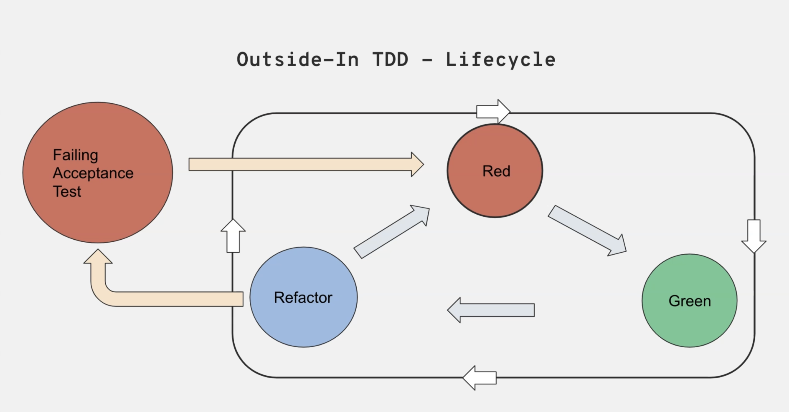

- we start with writing failing integration test like how our Ui 

- Then we start writing failing raw unit test and create classes when unit test requires

- we write logic in main code when our unit test asks.

- In Unit test we create real object of that class only , rest other classes should be mocked.

- UnitTest cases should be like documentation so naming conventions is important.
example: `PlayListViewmodelShould` is class name and then test name like `emitListOfItems`. by reading this whole it will be like `PlayList ViewModel Should emit list of items`


```kotlin
implementation("com.squareup.okhttp3:logging-interceptor:4.12.0")


import okhttp3.OkHttpClient
import okhttp3.logging.HttpLoggingInterceptor

// Create interceptor
val logging = HttpLoggingInterceptor().apply {
    level = HttpLoggingInterceptor.Level.BODY // Log everything
}

val client = OkHttpClient.Builder()
    .addInterceptor(logging)
    .build()

// Use it in Retrofit
val retrofit = Retrofit.Builder()
    .baseUrl("http://10.0.2.2:3001/")
    .client(client)
    .addConverterFactory(GsonConverterFactory.create())
    .build()

val api = retrofit.create(PlayListApi::class.java)

```

In Android Studio's default emulator (AVD based on QEMU), use this special IP:10.0.2.2

🔹 10.0.2.2 is a magic alias to your host machine (your laptop) from the emulator.

🔹 So, http://10.0.2.2:3001/... allows the emulator to access servers running on your laptop.

⚠️ If You're Using a Physical Device Instead

This method is only for emulator.

If you're testing on a physical Android device, then:
- Your device and laptop must be on the same Wi-Fi network.
- You must use your laptop’s local IP (e.g., 192.168.1.3:3001).
- Your server must still listen on 0.0.0.0.
- Disable firewalls or allow the port through.


### Adding hilt

Add Dependency in build.gradle
```kotlin
//build.gradle (Project)
buildscript {
    dependencies {
        classpath "com.google.dagger:hilt-android-gradle-plugin:2.51"
    }
}

// build.gradle (app)
plugins {
    id 'com.android.application'
    id 'kotlin-kapt'
    id 'dagger.hilt.android.plugin'
}

dependencies {
    implementation "com.google.dagger:hilt-android:2.51"
    kapt "com.google.dagger:hilt-compiler:2.51"
}


```

build.gradle.kts

```kotlin

// build.gradle.kts(App module)

plugins {
    id("com.android.application")
    id("org.jetbrains.kotlin.android")
    id("kotlin-kapt")
    id("dagger.hilt.android.plugin")
}

dependencies {
    implementation("com.google.dagger:hilt-android:2.51")
    kapt("com.google.dagger:hilt-compiler:2.51")
}


// build.gradle.kts(app)

android {
    compileOptions {
        sourceCompatibility = JavaVersion.VERSION_17
        targetCompatibility = JavaVersion.VERSION_17
    }
    kotlinOptions {
        jvmTarget = "17"
    }
}

```

Create Application Class
```kotlin
@HiltAndroidApp
class MyApp : Application()

//Update AndroidManifest.xml

<application
    android:name=".MyApp"
    ... />

```

Add Hilt Plugin to Root Settings (Optional)

If not already done in project-level settings.gradle.kts:

```kotlin
pluginManagement {
    plugins {
        id("dagger.hilt.android.plugin") version "2.51"
    }
}
```

Example

✅ Example Module
```kotlin
@Module
@InstallIn(SingletonComponent::class)
object NetworkModule {

    @Provides
    @Singleton
    fun provideRetrofit(): Retrofit = Retrofit.Builder()
        .baseUrl("http://10.0.2.2:3001/")
        .addConverterFactory(GsonConverterFactory.create())
        .build()
}


```

✅ Injecting in Activity
```kotlin
@AndroidEntryPoint
class MainActivity : AppCompatActivity() {

    @Inject lateinit var retrofit: Retrofit
}

```