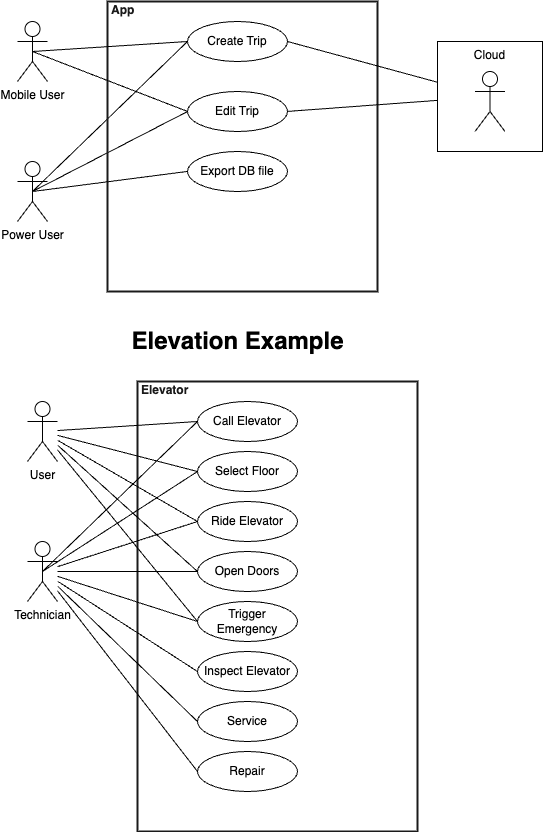
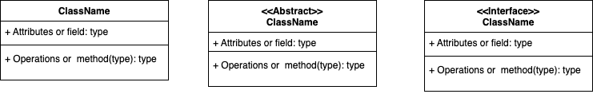
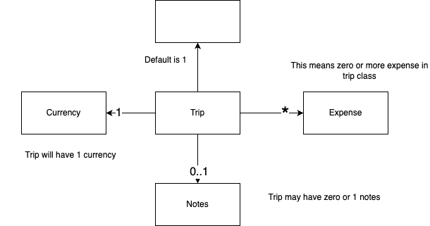
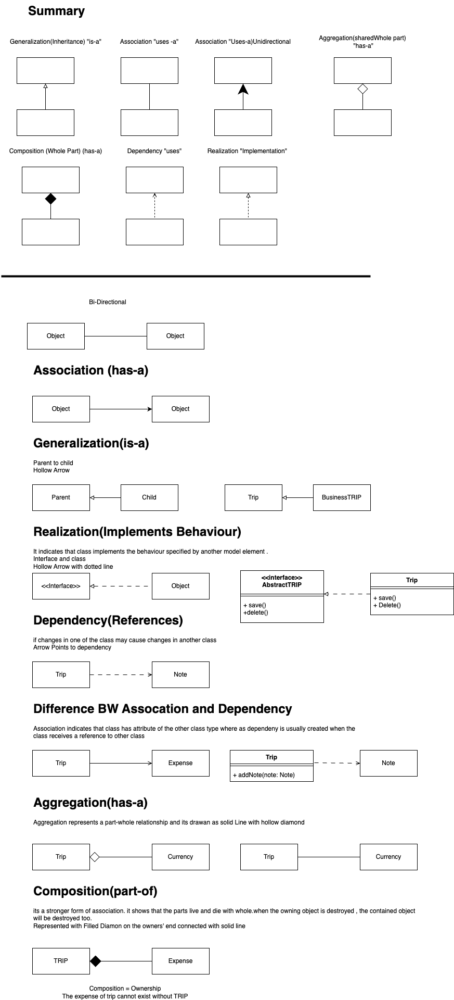

# Gather Requirements
Like [Application][Must][Do Something]

# Describe the system from the user point of View

- Usecase
    - Title
    - Actor
    - Details or scenario [Avoid technical details]
    - ex . 
        Title = create New Trip

        Actor = Mobile User

        Details = 
        1.  The user can initate the creation of new trip from main screen
        1. The assigns a default home currency based on phone settings
        1. ...
        1. ...

- User Story
    It is shorter than usecase
    
    : As a \<type of user> , I want <Some Goal> so that < Some Reason>

    ex. 
    1. As a user , i want to add notes to my expenses so that i can identity them later
    1. As a power user, i want to retrive the app's database file, so that i can inspect it on any computer

- Bigger stories are called EPICS
    
    ex. 
    As a traveller , i want to track my expensis while aboard so that i don't exceed my budget

    This above epic can be broken into multiple stories
    1. As a user, i want to create new trip , so that i can track each of my travel sepratly
    1. As a business traveller , i want to tag my busines trips, so that i can seprate them from personal trips

# UML Diagram
Standard Graphical notation used to describe object oriented systems

There are various types of diagram
1. Usecase diagram :- Shows Functionality of system with user point of View.
1. Strctural Diagram : Class diagram which shows strcture of system in terms of object, attributes,operations and relations
1. Behavioural Diagram : Describes the system's functionality focusing on what happens and the interations 

when something is unclear then try sketching diagrams , it helps to clear your idea.

## UseCase Diagram
Functional Use of system.

- Oval shows Usecase
- Primary Actors are on left side and secondary actor on right side
- Create Boundry for systems
- Line show interations

This shows what our system does
    - User can create and edit trips
    - Power user can export the app's database file
    - App data get backup to cloud

## Class Diagram

- ClassName should be came case
- Attribute should be lowercase

Visiblity : 

- \+ Public
- \- Private
- \# Protected
- \~ Package

- we can not put conditions like length> 3 so that can be done in getter and setter methods

Multiplicity : 

